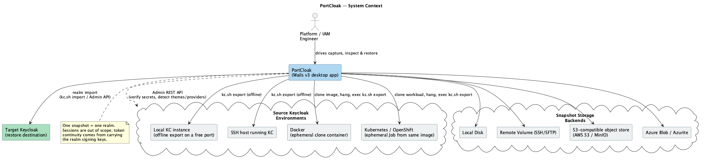

<!--
  Copyright 2026 Muhammad Salah
  SPDX-License-Identifier: Apache-2.0
-->

# 01 — Vision & Requirements

## 1.1 Vision

Moving a Keycloak realm between environments is deceptively hard. The stock realm export is
often "good enough for config" but silently loses the things that make a realm *usable after
the move*: password hashes, OTP/2FA enrollments, passkeys, client secrets, LDAP bind
credentials, IdP secrets, and the RSA keys that sign tokens. Operators then discover — in
production — that users can't log in, integrations are broken, and every existing token is
invalid.

**PortCloak's job is to make a realm move be a faithful clone, not a lossy config copy** — and
to do it from wherever Keycloak actually runs (a laptop, a bastioned SSH host, a Docker
container, a Kubernetes/OpenShift pod) into wherever the operator wants to keep the snapshot
(disk, an SSH volume, S3, Azure Blob) — over connections that may be slow, flaky, or drop
mid-transfer.

*Source: [`01-context.puml`](./diagrams/01-context.puml) · [SVG](./diagrams/svg/01-context.svg)*

## 1.2 Goals

- **G1 — Fidelity.** Capture a realm such that, after restore, users authenticate with existing
  credentials, 2FA still works, clients keep their secrets, federations reconnect, and token
  continuity is preserved where possible (signing keys carried).
- **G2 — Reach.** Capture from Local, SSH, Docker, and Kubernetes/OpenShift targets through one
  consistent workflow.
- **G3 — Portability of storage.** Store snapshots to Disk, Remote SSH volume, S3-compatible,
  or Azure Blob / Azurite, interchangeably.
- **G4 — Resilience.** Treat bad connections as the normal case: retry, resume, verify, and
  never leave a half-written snapshot that looks complete.
- **G5 — Transparency.** Every snapshot ships with a **manifest** that states exactly what was
  carried, what was partial, and what was intentionally or unavoidably left behind.
- **G6 — Safety.** Snapshots contain secrets; they are encrypted at rest by default and secrets
  are handled deliberately, never logged.
- **G7 — Usability.** A guided Wails desktop UI that a platform engineer can drive without
  memorizing `kc.sh` flags.

## 1.3 Non-goals (for the first design pass)

- **N1** — Not a continuous replication / HA sync tool. PortCloak takes point-in-time snapshots.
- **N2** — Not a Keycloak version upgrader. It documents version deltas but does not transform
  a realm across incompatible schema changes.
- **N3** — Not a general database backup tool. It operates at the realm-representation level
  (plus optional Admin-API verification), not raw DB dumps.
- **N4** — Not a secrets manager. It integrates with the OS keychain for its own connection
  credentials but does not become a vault.
- **N8** — **No user accounts, login, or multi-user model.** PortCloak is a single-user local
  desktop tool. There is no sign-in, no roles, and no per-user permissions inside the app; the
  only identity that matters is the credentials each environment or storage definition carries.
  The audit trail records *what happened and when*, not *who* — the operator is whoever is at
  the machine.
- **N5** — **Sessions are out of scope.** PortCloak does not capture or replay online/offline
  sessions. Users re-authenticate after a move. Token *continuity* is addressed differently and
  more reliably, by carrying the realm signing keys (see FR-F4) so tokens issued before the move
  remain verifiable.
- **N6** — **No selective restore.** Restore is whole-realm. Cherry-picking individual users or
  clients out of a snapshot is deliberately excluded to avoid partial-state hazards.
- **N7** — **Themes, provider JARs and other on-disk assets are not migrated.** They live outside
  the realm representation. PortCloak *detects and reports* them so they can be provisioned at
  the destination deliberately (see FR-D1).

## 1.4 Glossary

| Term | Meaning |
|------|---------|
| **Realm** | A Keycloak tenant boundary: its own users, clients, roles, keys. |
| **`kc.sh export`** | Keycloak's CLI export producing a realm representation (JSON). Primary capture mechanism. |
| **Realm representation** | The JSON model of a realm (`RealmRepresentation`) — the import/export unit. |
| **Component** | Keycloak's plug-in config record. Key providers, LDAP federation, and LDAP mappers are all stored as *components* and thus travel in the realm export. |
| **Environment** | A configured Keycloak execution context PortCloak can capture from or restore to — local, SSH, Docker, or Kubernetes/OpenShift. Replaces the earlier "profile". |
| **Storage** | A configured destination where snapshot bundles are written and read — Disk, SSH, S3-compatible, or Azure Blob. Several may be defined; one is the default. |
| **Snapshot** | The sealed, checksummed (and optionally encrypted) single-realm bundle PortCloak produces (see [06](./06-snapshot-and-manifest.md)). |
| **Manifest** | The human- and machine-readable inventory of what a snapshot carries (see [07](./07-realm-carryover-manifest.md)). |
| **Verification** | Optional Admin REST API pass that confirms exported secrets are unmasked and detects external dependencies. Never the authoritative source. |
| **Executor** | Adapter that runs a command in a target's execution context and streams artifacts back. |
| **Ephemeral clone** | A throwaway container/Job created from a serving workload's own image and config, started hung, used to run the export, then destroyed (see [03 §3.3](./03-capture-targets.md)). |
| **Completeness report** | Classification of every category as captured / partial / missing / **out-of-scope** — the last distinguishing design decisions from failures. |

## 1.5 Functional requirements

### Capture

- **FR-C1** Capture one or more realms from a **local** Keycloak install by invoking `kc.sh export`.
- **FR-C2** Capture from a **remote SSH host** by running `kc.sh export` over SSH and streaming artifacts back.
- **FR-C3** Capture from a **Docker container** via `docker exec` (and equivalents: `podman`, `nerdctl`).
- **FR-C4** Capture from a **Kubernetes/OpenShift pod** via `kubectl exec` / `oc exec`, selecting namespace + pod/container.
- **FR-C5** Use `kc.sh export` with **users in separate files** to scale to large user counts.
- **FR-C6** **Verify via Admin REST API** (when a running server is reachable) that exported
  secrets are real rather than masked.
- **FR-C7** Detect Keycloak **version** and `kc.sh` location on the target before running.
- **FR-C8** **Offline `kc.sh export` is the default and primary capture mode** on every target.
- **FR-C9** On **Docker and Kubernetes/OpenShift**, run the export inside an **ephemeral clone** of
  the workload — a new container/Job created from the **same image and configuration**, started
  hung, exec'd into, and destroyed afterwards. The **serving instance is never exec'd into,
  never written to, and never competes for resources with the export**.
- **FR-C10** On **local and SSH** targets, run the offline export bound to **automatically
  allocated free ports** (HTTP, HTTPS and management), so it cannot collide with the running
  instance and exit non-zero.
- **FR-C11** **Always clean up**: ephemeral clones and remote temp directories are destroyed on
  success *and* on failure, with an orphan sweep on next launch.

### Content fidelity (see the full list in [07](./07-realm-carryover-manifest.md))

- **FR-F1** Carry **users** with password **hashes** (algorithm, iterations, salt), not plaintext.
- **FR-F2** Carry **OTP/TOTP** secrets and **WebAuthn/passkey (soft-token/FIDO2)** credentials.
- **FR-F3** Carry **client secrets unmasked** so imported clients authenticate unchanged.
- **FR-F4** Carry **RSA/EC/HMAC/AES key providers including private keys** so token signing continuity is preserved.
- **FR-F5** Carry **LDAP/Kerberos user federation** including bind credentials and all LDAP mappers.
- **FR-F6** Carry **identity providers (IdP federations)** including client secrets / signing certs and IdP mappers.
- **FR-F7** Carry **clients, client scopes, roles, groups, protocol mappers, authorization services**.
- **FR-F8** Carry **authentication flows**, required actions, and authenticator configs (incl. secrets).
- **FR-F9** Carry **realm settings**: token/session lifespans, password policy, brute-force, OTP/WebAuthn policy, SMTP (with password), themes, localization, attributes.
- **FR-F10** *(withdrawn — sessions are out of scope, see N5.)* Token continuity is delivered by
  **FR-F4** (carrying signing keys), not by session capture.

### Configuration — environments & storage

- **FR-N1** Define and persist **multiple environments**, each of one kind:
  - **Local** — path to the **Keycloak server folder** (the install root containing `bin/kc.sh`).
  - **SSH** — host, port, user, auth method, optional jump host, and the **Keycloak server
    folder** on the remote host.
  - **Docker** — Docker endpoint and the target **service/container** running Keycloak.
  - **Kubernetes / OpenShift** — kubeconfig context, **namespace**, and the target
    **Deployment or StatefulSet** running Keycloak.
- **FR-N2** Define and persist **multiple storage definitions**, each of one kind, and each
  rooted at a **folder / prefix** so one backend can hold several independent snapshot trees:
  - **Disk** — root folder.
  - **SSH** — host + credentials + remote folder.
  - **S3** — endpoint, region, bucket, and key prefix (folder).
  - **Azure Blob / Azurite** — account/endpoint, container, and blob prefix (folder).
- **FR-N3** **Test** an environment or a storage definition on demand, reporting a concrete
  pass/fail with the reason.
- **FR-N4** **Create, edit, duplicate and delete** environments and storage definitions, with
  deletion blocked or warned when something references them.
- **FR-N5** Mark one storage definition as the **default** for new captures.
- **FR-N6** Persist configuration in a **human-readable file under the user's home folder**
  (`~/.portcloak/`), with all secrets held in the **OS keychain** and referenced by handle.

### External dependency detection

- **FR-D1** **Detect and report** assets a realm depends on that live outside the realm
  representation — custom **themes**, deployed **provider/SPI JARs**, keystore/truststore files —
  and record them in the manifest as items to be **provisioned manually at the destination**.
  PortCloak does **not** attempt to migrate them.
- **FR-D2** Surface these as explicit **restore preconditions** so an operator sees them before
  importing, not after logins start failing.

### Storage

- **FR-S1** Store snapshots to a **local disk folder** with a browsable layout.
- **FR-S2** Store to a **folder on a remote host over SSH/SFTP**.
- **FR-S3** Store to an **S3-compatible** bucket + prefix (AWS S3, MinIO) using multipart uploads.
- **FR-S4** Store to an **Azure Blob** container + prefix, validated against the **Azurite**
  emulator, using block-blob uploads.
- **FR-S5** **List, retrieve, and delete** stored snapshots from any backend.
- **FR-S6** **One snapshot contains exactly one realm.** Capturing several realms produces several
  independent snapshots, each individually restorable, verifiable and retainable.

### Restore

- **FR-R1** Restore a snapshot into a target via `kc.sh import` (offline) or Admin API `partialImport` (running).
- **FR-R2** Offer a **dry-run diff** and manifest preview before writing to the target.
- **FR-R3** Support **overwrite / skip / merge** strategies for existing resources.
- **FR-R4** Verify snapshot **integrity and decrypt** before any restore action.

### Inspection & browsing

- **FR-V1** Browse a **library of snapshots across all configured storage backends**, showing realm, capture
  date, source environment, counts and a completeness badge — **without requiring decryption
  keys** (served from the non-secret sidecar manifest).
- **FR-V2** **View a snapshot's full details**: realm settings, key providers (KIDs/algorithms),
  clients, client scopes, roles, groups, identity providers, LDAP federation, authentication
  flows, the secret ledger, the completeness report, and capture provenance.
- **FR-V3** **Browse the users contained in a snapshot** with pagination, sorting and free-text
  search across username, email, first/last name and user ID.
- **FR-V4** **Filter and facet users** by enabled state, origin (local vs LDAP-federated), realm
  or client role, group membership, required actions, and second-factor type (OTP / passkey).
- **FR-V5** **View an individual user's detail**: attributes, realm and client role mappings,
  group memberships, federated identity links, required actions, and **credential presence**
  (has password + which hashing algorithm, OTP enrolments, passkey count, recovery codes) —
  presence and metadata only, **never credential values**.
- **FR-V6** **Browse every other entity type** held in the snapshot: clients (including whether a
  secret is present), client scopes, realm/client roles, groups, identity providers, LDAP
  providers and their mappers, key providers, authentication flows, and the detected external
  dependencies (themes, provider JARs).
- **FR-V7** **Reveal an individual secret** (e.g. a client secret) only on an explicit, **audited**
  user action; secrets are redacted by default in every view.
- **FR-V8** **Verify a snapshot's integrity** (and decryptability) on demand, without performing a
  restore.
- **FR-V9** *(withdrawn — snapshot comparison is out of scope. The pre-restore **dry-run diff**
  against a live target realm remains, under FR-R2.)*
- **FR-V10** **Export an inspection view** (user list, client list, secret ledger, completeness
  report) as CSV/JSON for audit and change-review purposes.

### Manifest & reporting

- **FR-M1** Produce a **manifest** per snapshot listing every carried category and secret.
- **FR-M2** Produce a **completeness report** flagging partial/missing categories with reasons.
- **FR-M3** Manifest is both **machine-readable (JSON)** and **rendered for humans** in the UI.

## 1.6 Non-functional requirements

- **NFR-1 Resilience.** Any network operation must survive transient drops via bounded retries
  with exponential backoff + jitter; large transfers must be **resumable across app restarts**
  (see [05](./05-resilience.md)). A failed transfer never yields a bundle that *looks* valid.
- **NFR-2 Integrity.** Every artifact is checksummed (SHA-256); the bundle carries a checksum
  tree; restore refuses on mismatch.
- **NFR-3 Security.** Snapshot encryption is **opt-in** (prominently offered, not forced); when it
  is declined the bundle holds unmasked secrets in the clear and the UI says so unambiguously.
  Secrets are never written to logs; PortCloak's own connection credentials live in the OS
  keychain (see [08](./08-security.md)).
- **NFR-4 Portability.** Single self-contained binary per OS (macOS/Linux/Windows) via Wails;
  no server component.
- **NFR-5 Observability.** Structured logs, live progress events to the UI, and an audit trail
  of what was captured or restored, where, and when. There is no user identity to record (N8).
- **NFR-6 Performance.** Streaming (no full-file buffering in RAM); concurrency for
  many-user realms and multipart transfers; backpressure honored.
- **NFR-7 Least privilege.** Read-only on the source wherever possible; restore requires an
  explicit, separately-scoped destination environment.
- **NFR-8 Idempotence.** Re-running a capture with the same inputs yields an equivalent
  snapshot; re-running an interrupted transfer converges, never duplicates.

- **NFR-9 Inspection responsiveness.** Browsing a snapshot must never require loading it fully
  into memory: user files are stream-parsed once into a **session-scoped SQLite index**, after
  which paging, searching and faceting are fast and bounded — a realm with 100k+ users stays
  usable.
- **NFR-10 No inspection residue.** The inspection index is built when a snapshot is opened and
  **destroyed when it is closed**. Usernames, emails and group data never persist on disk between
  sessions.

- **NFR-11 Transparent, file-based configuration.** The tool's own state — environments,
  storage definitions, preferences, job checkpoints — lives in **plain readable files** under
  `~/.portcloak/`, not in a database. It can be read, diffed, version-controlled, hand-edited
  and backed up with ordinary tools. **SQLite is used only for throwaway snapshot indexes**
  (NFR-9/NFR-10), each in its own file, never for tool state. `~/.portcloak/` is the default
  rather than a constant: the folder can be moved from Settings, or pinned with `PORTCLOAK_HOME`
  ([09 §9.1c](./09-workflows-and-ui.md)).

## 1.7 Key design tension: what `kc.sh export` does and does not give us

PortCloak leans on `kc.sh export` (FR requirement from the brief) but must be honest about
its edges. This shapes the whole architecture:

| Data | In `kc.sh export`? | PortCloak strategy |
|------|--------------------|--------------------|
| Realm settings, clients, roles, groups, scopes | Yes | Primary path |
| Users + password hashes | Yes (`--users` modes) | Primary path, separate-files for scale |
| OTP / WebAuthn credentials | Yes (stored as user credentials) | Primary path |
| Client secrets | Yes (present in realm JSON) | Primary path; **verify** via Admin API |
| Key providers incl. **private keys** | Yes (stored as components) | Primary path; **verify** active keys present |
| LDAP federation + mappers | Yes (components) | Primary path |
| IdP federations + mappers | Yes | Primary path |
| Auth flows, required actions, authenticator config | Yes | Primary path |
| SMTP password, IdP secret, LDAP bind credential | Yes (in realm JSON) | Primary path; flagged as secrets in manifest |
| **Online sessions** | **No** | **Out of scope** (N5) — users re-authenticate |
| **Offline sessions / offline tokens** | **No** | **Out of scope** (N5) |
| Custom themes / provider JARs | **No** | **Detected and reported**, never migrated (FR-D1) |
| Revocation/`notBefore` policies mid-flight | Partial | Captured from realm settings where represented |

`kc.sh export` therefore carries essentially everything that *matters for a realm to work* —
which is why it is the primary and default mechanism. The Admin API is used only to **verify**
what the export produced and to **detect external dependencies**, not to fill a fidelity gap.
The two genuine gaps are handled by scoping rather than by pretending:

- **Sessions** are declared out of scope (N5); token continuity comes from carrying signing keys.
- **Themes and provider JARs** are detected and reported (FR-D1), never silently dropped.

This is restated as a completeness contract in [07](./07-realm-carryover-manifest.md).
