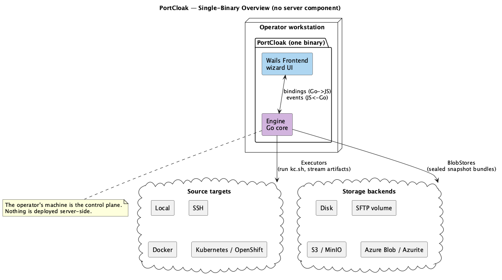
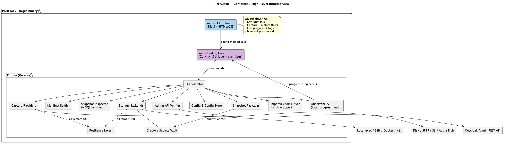
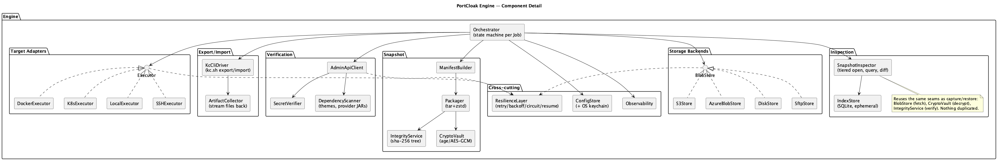

<!--
  Copyright 2026 Muhammad Salah
  SPDX-License-Identifier: Apache-2.0
-->

# 02 — Architecture


## 2.1 Shape of the system

PortCloak is a **single self-contained desktop binary** built with Wails: a Go core (the
"Engine") with a web-technology frontend, bridged by Wails' binding layer. There is **no
server component** — the operator's machine is the control plane, reaching out to targets and
storage backends directly.



*Source: [`09-engine-overview.puml`](./diagrams/09-engine-overview.puml) · [SVG](./diagrams/svg/09-engine-overview.svg)*

## 2.2 Layering

1. **Presentation (Wails frontend).** Wizard-based UI, live progress, manifest preview/diff.
   Stateless beyond view state; all real work is delegated to the Engine. Details in [09](./09-workflows-and-ui.md).
2. **Binding layer (Wails).** Thin Go structs exposed to JS: `CaptureController`,
   `RestoreController`, `ConfigController`, `SnapshotController`, `InspectController`. Long-running work runs in Go
   goroutines and reports back through the **Wails event bus** (`runtime.EventsEmit`) so the UI
   stays responsive. No business logic lives here.
3. **Engine (Go core).** All orchestration and I/O. Organized as the components below; each is
   an interface-first package so targets and storage backends are pluggable and testable with fakes.



*Source: [`02-containers.puml`](./diagrams/02-containers.puml) · [SVG](./diagrams/svg/02-containers.svg)*

## 2.3 Engine components (module map)

| Module | Package (proposed) | Responsibility |
|--------|--------------------|----------------|
| **Orchestrator** | `engine/orchestrator` | Per-job state machine; sequences probe → clone → export → fetch → verify → teardown → manifest → package → store (and the restore path). Emits progress. |
| **Target Adapters** | `engine/target` | `Executor` implementations: Local, SSH, Docker, K8s. Run commands in the execution context and stream artifacts back. |
| **Ephemeral Clone Manager** | `engine/target/clone` | Derives a clone spec from a serving workload, materialises it hung, and guarantees teardown (Docker/K8s). See [03 §3.3](./03-capture-targets.md). |
| **Port Allocator** | `engine/target/ports` | Allocates free HTTP/HTTPS/management ports locally or on a remote host so offline export cannot collide. |
| **Kc CLI Driver** | `engine/kc` | Builds/parses `kc.sh export` & `import` invocations; understands `--users` modes, `--dir`/`--file`, exit codes, and version quirks. |
| **Admin API Verifier** | `engine/admin` | Admin REST client that verifies exported secrets are unmasked and detects external dependencies (themes, provider JARs). |
| **Manifest Builder** | `engine/manifest` | Parses exported artifacts into the realm inventory + completeness report. |
| **Snapshot Packager** | `engine/snapshot` | tar + zstd bundling, integrity tree, envelope metadata. |
| **Crypto Vault** | `engine/crypto` | Encrypt/decrypt bundles (age / AES-256-GCM), key derivation, recipients. **Opt-in** — see [08 §8.2](./08-security.md). |
| **Storage Backends** | `engine/store` | `BlobStore` implementations: Disk, SFTP, S3, Azure Blob. |
| **Resilience Layer** | `engine/resil` | Retry, backoff+jitter, circuit breaker, checkpoint/resume, integrity re-check. Wraps *all* remote I/O. |
| **Config Store** | `engine/config` | Environment and storage definitions, preferences, job checkpoints — plain files under `~/.portcloak/`; secrets by keychain handle. |
| **Observability** | `engine/obs` | Structured logging, redaction, progress events, audit log. |
| **Snapshot Inspector** | `engine/inspect` | Tiered snapshot open, stream-parse, query API (list/search/facet/detail), diff. See [10](./10-snapshot-inspection.md). |
| **Index Store** | `engine/inspect/index` | **Session-scoped SQLite** projection store backing user/entity browsing — one throwaway `.sqlite` file per open snapshot, deleted on close. Never holds tool state. |
| **Home Lock** | `engine/config` | The advisory claim two front ends take on one `~/.portcloak`, so the startup sweep and a change to `config.yaml` cannot run concurrently with another PortCloak. See [13 §13.3](./13-command-line.md). |

Above the engine sit the composition root and two front ends, which is the only
place in the tree that knows a UI toolkit exists:

| Module | Package | Responsibility |
|--------|---------|----------------|
| **Composition root + controllers** | `internal/app` | Owns `~/.portcloak`, wires the adapter registry, and exposes engine capabilities as controller methods. Imports no Wails. |
| **Desktop shell** | `internal/desktop` | The window, the menu, the event bridge, and the service registry binding the controllers to the frontend. The only package allowed to import Wails. |
| **Command line** | `internal/cli` | Cobra commands, terminal progress rendering, exit codes. A peer of the desktop shell, not a layer under it. See [13](./13-command-line.md). |



*Source: [`03-components.puml`](./diagrams/03-components.puml) · [SVG](./diagrams/svg/03-components.svg)*

## 2.4 Core interfaces (design intent, not final signatures)

These are the seams that keep targets/storage backends pluggable and the resilience layer uniform.

```go
// A source environment we run kc.sh in and pull files from.
type Executor interface {
    Probe(ctx context.Context) (TargetFacts, error)           // KC version, kc.sh path, ports, clone feasibility
    Prepare(ctx context.Context) (ExecContext, error)         // materialise ephemeral clone, or use in place
    Run(ctx context.Context, cmd Command) (ExecResult, error)  // stream stdout/stderr
    FetchDir(ctx context.Context, remote string, storage backend ArtifactSink) error // stream export dir back
    Teardown(ctx context.Context) error                       // destroy clone + temp dirs; ALWAYS called
    Close() error
}

// Docker and K8s implement this; Local and SSH report ModeInPlace.
type ExecContext struct {
    Mode     ExecMode // ModeInPlace | ModeEphemeralClone
    CloneRef string   // container ID / Job name, recorded in provenance
    Ports    PortSet  // free http/https/management ports for the offline export
}

// A destination for the sealed snapshot bundle. Resumable variants add multipart.
type BlobStore interface {
    Stat(ctx context.Context, key string) (ObjectInfo, error)
    Put(ctx context.Context, key string, r io.Reader, opts PutOptions) (PutResult, error)
    Get(ctx context.Context, key string, w io.Writer, opts GetOptions) (GetResult, error)
    List(ctx context.Context, prefix string) ([]ObjectInfo, error)
    Delete(ctx context.Context, key string) error
}

type ResumableStore interface {
    BlobStore
    InitMultipart(ctx context.Context, key string) (UploadID, error)
    PutPart(ctx context.Context, id UploadID, n int, r io.Reader) (PartETag, error)
    CompleteMultipart(ctx context.Context, id UploadID, parts []PartETag) (PutResult, error)
    AbortMultipart(ctx context.Context, id UploadID) error
}

// Everything remote is wrapped so resilience is uniform, not per-call boilerplate.
type Doer interface {
    Do(ctx context.Context, op func(context.Context) error) error // retry/backoff/circuit
}
```

The **Orchestrator** depends only on these interfaces plus `ManifestBuilder`, `Packager`,
`CryptoVault`. Targets and storage backends are selected from a **registry** keyed by environment/storage kind, so
adding e.g. a `podman` target or a GCS storage backend later is additive.

## 2.5 Capture principle: one authoritative source, verified

Offline `kc.sh export` is the **single authoritative capture mechanism** on every target. It
reads the realm from the database and yields the complete representation — users, credential
hashes, OTP and passkey enrolments, client secrets, key providers with private material, LDAP
and IdP federations, auth flows.

The Admin REST API plays a strictly **secondary, non-authoritative** role and is optional:

1. **Secret verification** — confirm exported secrets are real values rather than `**********`,
   guarding against Keycloak-version masking quirks. A masked secret is flagged `partial`
   instead of shipping as a dud.
2. **External dependency detection** — enumerate custom themes and deployed provider/SPI JARs so
   they can be **reported** as restore preconditions (FR-D1). These are never migrated.

If the Admin API is unreachable, capture still succeeds; the completeness report simply records
that verification was skipped. The Manifest Builder combines export and verification results into
the **completeness report** so nothing silently vanishes.

**Sessions are out of scope** (N5). Token continuity is delivered instead by carrying the realm's
signing keys, which is both more reliable and entirely within the export's reach.

## 2.6 Configuration & on-disk layout

PortCloak is a **single-user local tool with no login** (N8). Everything it knows lives under
the user's home folder, in formats a person can read:

```
~/.portcloak/
  config.yaml            # environments, storage definitions, preferences  (human-readable)
  jobs/<job-id>.json     # job state + transfer checkpoints (resume across restarts)
  logs/portcloak.log     # structured, redacted
  index/<snapshot-id>.sqlite   # EPHEMERAL inspection index — created on open, deleted on close
```

**Why the tool's state is not in a database.** `config.yaml` is the source of truth for
environments and storage definitions. Keeping it as a readable file means an operator can diff
it, commit it, hand-edit a hostname, or copy it to another machine — none of which is pleasant
against an opaque database. Job checkpoints are per-job JSON for the same reason: a stuck job
can be inspected and, if necessary, deleted by hand.

**SQLite is deliberately confined to one job.** It backs *snapshot inspection indexes only*
([10 §10.3](./10-snapshot-inspection.md)) — one file per open snapshot, in its own directory,
created on open and deleted on close. It is a disposable query accelerator, never a store of
record. This keeps a crash from corrupting configuration, keeps PII out of long-lived storage
(NFR-10), and means deleting `index/` at any time is always safe.

**Secrets never appear in `config.yaml`.** Each credential is stored in the **OS keychain** and
referenced by handle:

```yaml
environments:
  - name: prod-eu
    kind: kubernetes
    context: prod-cluster
    namespace: iam-prod
    workload: statefulset/keycloak
  - name: kc-01
    kind: ssh
    host: kc-01.internal
    user: deploy
    serverFolder: /opt/keycloak
    credentialRef: keychain://portcloak/ssh/kc-01     # value lives in the OS keychain

storage:
  - name: prod-backups
    kind: s3
    endpoint: s3.eu-west-1.amazonaws.com
    bucket: iam-snapshots
    prefix: portcloak/                                 # the "folder" within the bucket
    credentialRef: keychain://portcloak/s3/prod
    default: true
  - name: local-disk
    kind: disk
    folder: ~/PortCloak/snapshots
```

## 2.7 Job model & concurrency

- A **Job** is the unit of work (a capture or a restore) with a persisted **JobState** so it
  survives app restarts (crucial for resume — see [05](./05-resilience.md)).
- The Orchestrator is a **state machine** per job; each transition is checkpointed.
- Concurrency: per-user file streaming and multipart part uploads run on a bounded worker
  pool; `context.Context` threads cancellation everywhere; backpressure via bounded channels.
- Multiple realms in one capture run as sibling sub-jobs sharing one bundle.

## 2.8 Technology choices (proposed, with rationale)

| Concern | Choice | Why |
|---------|--------|-----|
| Desktop shell | **Wails v3** | Go-native, single binary, web UI; v3 for its improved multi-window and application APIs. Confined to `internal/desktop`, because on Linux it is cgo over GTK and the command line must build without a toolkit (NFR-12). |
| Command line | **`spf13/cobra`** | The convention every Go operator already knows, and it brings one dependency that is not already in the graph (`inconshreveable/mousetrap`, Windows only). |
| SSH/SFTP | `golang.org/x/crypto/ssh` + `pkg/sftp` | Mature, pure-Go, no external ssh binary needed. |
| Docker | Docker Engine API (`github.com/docker/docker/client`) with CLI fallback | API avoids shelling out; CLI fallback for podman/nerdctl. |
| Kubernetes | `client-go` + SPDY/remotecommand exec | Same mechanism `kubectl exec` uses; works for OpenShift (`oc`) too. |
| S3 | `aws-sdk-go-v2` | Multipart, checksums, MinIO-compatible via custom endpoint. |
| Azure | `azure-sdk-for-go` blob | Block blobs; Azurite via connection-string/endpoint override. |
| Compression | **zstd** (`klauspost/compress`) | Fast, strong ratio, streaming. |
| Encryption | **age** (X25519) and/or AES-256-GCM passphrase mode | Simple, modern, auditable; recipient- or passphrase-based. **Opt-in.** |
| Checksums | SHA-256 | Ubiquitous; matches S3/Azure server-side options. |
| Keychain | `zalando/go-keyring` (macOS Keychain, Windows Cred, libsecret) | Keeps PortCloak's own creds out of plaintext config. |
| Logs | `slog` with redaction handler | Structured + secret-safe. |
| Inspection index | **SQLite** (`modernc.org/sqlite`, pure-Go) | Rich querying + FTS for user search; pure-Go build avoids cgo. **Ephemeral indexes only — never tool state** ([§2.6](#26-configuration--on-disk-layout)). |
| Configuration | **YAML file** under `~/.portcloak/` | Readable, diffable, hand-editable, version-controllable. No database for tool state (NFR-11). The folder is relocatable ([09 §9.1c](./09-workflows-and-ui.md)). |
| Container clone | Docker Engine API / `client-go` Jobs | Ephemeral clone execution ([03 §3.3](./03-capture-targets.md)). |

## 2.9 Why this architecture satisfies the brief

- **Reach** is isolated behind `Executor`, so Local/SSH/Docker/K8s are four small adapters over
  one workflow (FR-C1..C4), with the Ephemeral Clone Manager and Port Allocator enforcing
  "never disturb the serving instance" structurally (FR-C9, FR-C10).
- **Storage portability** is isolated behind `BlobStore`/`ResumableStore` (FR-S1..S5).
- **Bad-connection tolerance** is a *cross-cutting layer* (`resil`) that wraps every remote
  call — not scattered retry code (NFR-1).
- **Fidelity** is a data concern owned by the Kc CLI Driver + Admin API Verifier + Manifest Builder, with
  the manifest as the contract ([07](./07-realm-carryover-manifest.md)).
- **Safety** is owned by the Crypto Vault + redaction + keychain ([08](./08-security.md)).

Full requirement→module mapping is in [11](./11-traceability.md).
