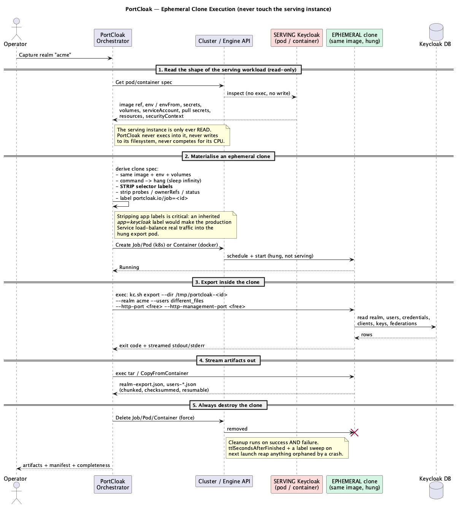

<!--
  Copyright 2026 Muhammad Salah
  SPDX-License-Identifier: Apache-2.0
-->

# 03 — Capture Targets


*Source: [`05-capture-sequence.puml`](./diagrams/05-capture-sequence.puml) · [SVG](./diagrams/svg/05-capture-sequence.svg)*

All four targets implement the single `Executor` interface ([02 §2.4](./02-architecture.md)).
The Orchestrator never knows *how* it reached a target — only that it can `Probe`, `Run`, and
`FetchDir`. This is what makes "capture from anywhere" one workflow instead of four.

## 3.1 Two governing rules

Everything in this document follows from two decisions:

> **Rule 1 — Offline `kc.sh export` is the default capture mode on every target.**
> It reads the realm directly from the database and produces the complete representation
> (users, credentials, secrets, keys, federations) in one pass.

> **Rule 2 — Never disturb the serving instance.**
> Offline export boots its own Keycloak runtime. Running that *inside a container that is
> currently serving traffic* would contend for CPU and memory, collide on ports, write into a
> live filesystem, and risk being killed by a liveness probe. So on Docker and Kubernetes,
> PortCloak creates an **ephemeral clone** and works there instead; on local and SSH targets,
> where a clone is not applicable, it isolates by **allocating free ports**.

## 3.2 The common capture contract

Every target goes through the same steps:

1. **Probe** — verify reachability; read the Keycloak version and `kc.sh` path; check free space;
   allocate free ports; confirm permissions needed to create/destroy an ephemeral clone.
2. **Materialise** *(Docker/K8s only)* — create the ephemeral clone and wait until it is running.
3. **Prepare** — create a temp export dir (`/tmp/portcloak-<jobid>`) inside the execution context.
4. **Export** — run offline `kc.sh export` (see [3.7](#37-the-kcsh-export-invocation)).
5. **Fetch** — stream the export dir back, never buffering whole files in RAM; checksum on arrival.
6. **Verify** *(optional)* — Admin API confirms secrets are unmasked; detect external dependencies.
7. **Destroy** — remove the temp dir **and the ephemeral clone**, on success *and* on failure.

All remote I/O runs through the resilience layer ([05](./05-resilience.md)).

## 3.3 Ephemeral clone execution (Docker & Kubernetes)



*Source: [`15-ephemeral-capture.puml`](./diagrams/15-ephemeral-capture.puml) · [SVG](./diagrams/svg/15-ephemeral-capture.svg)*

The pattern is identical on both platforms:

1. **Read** the serving workload's spec — image reference, environment (including DB URL and
   credentials), mounted secrets/configs, service account, pull secrets, resource limits,
   security context. The serving instance is **only ever read**.
2. **Derive a clone spec** from it: same image, same configuration, but with
   - the entrypoint/command replaced by a **hang** (`sleep infinity`),
   - **no published/exposed ports**,
   - health probes removed,
   - a distinguishing label (`portcloak.io/job=<id>`).
3. **Start** the clone and wait for `Running`. It boots nothing and serves nothing — it is a
   parked copy of the environment, waiting to be exec'd into.
4. **Exec** the offline export inside it, streaming stdout/stderr back live.
5. **Stream out** the artifacts.
6. **Destroy** the clone unconditionally.

### Why a hung clone rather than a one-shot command container

Hanging the container and exec'ing into it (rather than making `kc.sh export` the container's
command) buys three things: the export's stdout/stderr streams back interactively for live
progress; a failed export can be **retried in place** without paying container startup again;
and the artifacts can be streamed out of a container that is still alive, instead of racing a
terminating one for its filesystem.

### The label trap

When cloning a workload spec, **selector labels must be stripped**. A pod inheriting
`app=keycloak` would be picked up by the production `Service` and start receiving **real user
traffic** into a hung container that serves nothing. PortCloak removes all inherited labels and
applies only its own. This applies equally to Docker networks with service discovery aliases.

Also stripped: `ownerReferences`, `resourceVersion`, `uid`, `nodeName`, `status`, and any
`Deployment`/`StatefulSet` controller reference — otherwise the clone could be adopted or
garbage-collected by the wrong controller.

Deliberately **kept**: `imagePullSecrets` (private registries), `serviceAccountName` (may carry
DB IAM auth), volumes holding DB TLS material, `securityContext` (OpenShift SCCs will otherwise
reject the pod), `nodeSelector`/`tolerations` (the clone must be schedulable where the DB is
reachable), and resource requests large enough for the export JVM.

### Cleanup guarantees

- Deletion runs in a `defer`-style path covering success, failure and cancellation.
- Kubernetes Jobs additionally set `ttlSecondsAfterFinished` as a backstop.
- On launch, PortCloak sweeps for orphans by its own label and offers to remove them — so a
  crashed session cannot silently leave a parked container running forever.

### Honest cost of this approach

The clone consumes scheduling capacity (a pod's worth of CPU/memory) for the duration of the
export, and a namespace under tight `ResourceQuota` may refuse it — `Probe` checks quota and
reports this up front rather than failing mid-run. The database still bears the read load of the
export regardless of where it runs; the clone protects the *serving Keycloak process*, not the
database. Large-realm exports are therefore still best scheduled off-peak.

## 3.4 Local target (FR-C1, FR-C10)

- **Mechanism:** direct `os/exec` of the local `kc.sh` (or `kc.bat` on Windows).
- **Discovery:** `PATH`, common install dirs (`/opt/keycloak/bin`, `$KEYCLOAK_HOME/bin`), or the
  **server folder** recorded on the environment.
- **Free-port isolation.** Offline export starts an embedded Keycloak runtime, and on some
  versions that runtime binds a port. PortCloak prevents a collision by:
  1. binding `127.0.0.1:0` to have the OS assign unused ports, recording them, then releasing;
  2. **passing only the port options that this `kc.sh` accepts**, discovered by asking it
     (`kc.sh export --help-all`) in the context the export will run in. Which options exist is a
     property of the binary, not of this document — see §3.8;
  3. treating a bind-conflict exit as **retryable** *when a port option was actually passed*:
     there is an unavoidable race between releasing a port and the export claiming it, so
     PortCloak re-allocates and retries a bounded number of times. Where the command takes no
     port option, reallocating cannot change what it sees, so the conflict is reported instead.
- **Fetch:** a local filesystem copy — still checksummed and streamed through the same pipeline
  so downstream code stays target-agnostic.
- **Edge cases:** permissions on the export dir; DB reachable from the export process.

## 3.5 SSH target (FR-C2, FR-C10)

- **Mechanism:** pure-Go SSH (`x/crypto/ssh`) for `Run`, SFTP (`pkg/sftp`) or a `tar` stream for
  `FetchDir`.
- **Auth:** private key (with passphrase), agent, or password — from the OS keychain, not the
  config file. Supports **bastion/jump host** chaining.
- **Free ports:** the same problem exists remotely and is harder to see, so PortCloak probes for
  free ports **on the remote host** (a short exec that binds `:0`) and passes them to the export.
- **Fetch strategy:** `tar -C /tmp/portcloak-<id> -cf - . | zstd` piped over the SSH channel,
  unpacked locally; resumable via SFTP offset restart if the stream drops.
- **Bad-connection focus:** SSH is the most drop-prone path — keepalives, per-op timeouts,
  circuit breaking, and checkpointed resume by remote path + byte offset.
- **Edge cases:** `sudo` needed to run `kc.sh`; non-interactive shells; restricted `PATH`; free
  space in `/tmp` (checked during probe against the estimated export size).

> **Why no ephemeral clone over SSH?** There is no container runtime to clone into — the host
> *is* the execution context. Port isolation is the available lever, and it is sufficient,
> because the export runs as a separate OS process rather than inside the serving one.

## 3.6 Docker target (FR-C3, FR-C9)

- **Mechanism:** Docker Engine API. `ContainerInspect` on the serving container to read its
  image, env, networks and mounts; `ContainerCreate` for the clone (entrypoint overridden to
  hang, no port bindings, labelled); `ContainerExecCreate`/`Attach` to run the export;
  `CopyFromContainer` (a tar stream) to fetch; `ContainerRemove(force)` to destroy.
- **CLI fallback** (`docker`, `podman`, `nerdctl`) when the socket is not exposed.
- **Network:** the clone joins the **same network** as the original so the database is reachable,
  but with **no network aliases** inherited — see the label trap above.
- **Remote Docker:** `DOCKER_HOST` over TLS and Docker-over-SSH work identically and ride the
  same resilience layer.
- **Where `kc.sh` is:** read from `KEYCLOAK_HOME` on the image, falling back to
  `/opt/keycloak/bin/kc.sh`. Both are guesses that are right for the official images and wrong
  for a custom build, so the environment carries a `kcPath` override that wins outright. The
  probe reports which path it will use and says when the answer came from the environment rather
  than from the image — a wrong path is then visible before a capture rather than during one.
- **Edge cases:** distroless images lacking `tar` (the API copy streams its own tar, so this is
  survivable); read-only root filesystem (export into a `tmpfs` mount PortCloak adds to the
  clone); image pulled from a registry that is no longer reachable (probe verifies the image is
  present locally before promising a clone).

## 3.7 Kubernetes / OpenShift target (FR-C4, FR-C9)

- **Mechanism:** `client-go`. Read the serving pod (and its owning Deployment/StatefulSet) to
  derive the clone; create a **Job** with `restartPolicy: Never`, `backoffLimit: 0`,
  `ttlSecondsAfterFinished`, and the command replaced by a hang; wait for `Running`; then
  `remotecommand` exec (the same SPDY/WebSocket mechanism `kubectl exec` uses); fetch via a
  `tar` stream exec (what `kubectl cp` is built on); delete the Job.
- **OpenShift:** identical API path; honors the `oc` login context. The inherited
  `securityContext` and service account keep the clone inside the same SCC that already admits
  the serving pod.
- **RBAC required** (documented for the operator up front, checked during probe):
  `create`/`get`/`list`/`delete` on `jobs` and `pods`, and `create` on `pods/exec`, in the target
  namespace. Read access to the serving workload's spec.
- **HA/clustered deployments:** because the clone reads the **shared database**, exporting from a
  clone is correct regardless of how many replicas serve traffic — and it no longer matters which
  pod you picked, which was a real source of confusion in the cluster case. Sessions, which *were*
  the cluster-specific complication, are out of scope (N5).
- **Where `kc.sh` is:** as on Docker — `KEYCLOAK_HOME` on the container spec, then
  `/opt/keycloak/bin/kc.sh`, then the environment's `kcPath` override ahead of both. A vendor
  rebuild that installs Keycloak elsewhere is ordinary, and the failure it caused arrived deep
  inside the export.
- **Edge cases:** `ResourceQuota` exhaustion (probe reports before starting); `PodSecurity`
  admission rejecting the clone (surfaced with the exact policy violation); no schedulable node
  matching inherited `nodeSelector`; exec disabled by policy (surfaced clearly, with the
  suggestion to run the capture from a host that has database access instead).

### Getting the export back out, without tar

`kubectl cp` runs `tar` inside the container, and so did PortCloak. The official Keycloak image
does not have one: it is assembled on `ubi-micro`, which ships neither `tar` nor `gzip`. The
result was a capture that exported the realm successfully, tore the clone down cleanly, and then
failed — because the exec channel closed on a binary that was not there.

PortCloak streams the directory itself instead. One `sh` invocation walks it and emits, per file:

    PCF <size> <name relative to the directory>\n
    <exactly size bytes>

which needs only `sh`, `find`, `wc`, `cat` and `printf`. That is a much smaller contract than
tar's, and it is one a minimal image cannot fail to meet. The restore path writes a file in over
stdin for the same reason. Neither direction sets ownership, and neither did before: the shell
runs as the pod's own user and cannot `chown`.

Two things follow from having been burned once. The command's stderr is captured and put in the
failure rather than discarded, because it is the half that names the missing binary. And a
non-zero exit is terminal rather than retryable — a directory that is not there does not become
there on the fourth attempt, and Docker's own archive endpoint (which tars *outside* the
container, and is why Docker was never affected) draws the same line.

## 3.8 The `kc.sh export` invocation

The Kc CLI Driver builds the command; the Executor runs it in whichever context applies.

**Default (offline export, users in separate files):**
```
kc.sh export \
  --dir /tmp/portcloak-<jobid> \
  --realm <realm> \
  --users different_files \
  --users-per-file 1000 \
  [--http-management-port <free>]     # only where this kc.sh accepts it
```

**Single-file variant (small realms):**
```
kc.sh export --file /tmp/portcloak-<jobid>/<realm>.json --realm <realm> --users realm_file
```

Design notes:
- `--users different_files` keeps per-file size bounded and lets PortCloak stream and checkpoint
  at file granularity — better behaviour on flaky links.
- `--realm` is **always** passed: one snapshot holds exactly one realm (FR-S6). Capturing several
  realms runs several exports and produces several independent snapshots.
- **Port options are discovered, not assumed.** This section originally specified `--http-port`
  and `--https-port` alongside the management port, on the reasoning that passing them cost
  nothing. It cost every capture: neither is an option of `export` or `import` on any Keycloak
  measured, and rejecting one aborts the command before it reads the realm
  (`Option: '--http-port' not valid for command export`). What `export` accepts, measured from
  the images kept in `testdata/kc-help`:

  | Keycloak | port options on `export` |
  |----------|--------------------------|
  | 24.0 | none |
  | 25.0 – 26.3 | `--http-management-port` (plus the management TLS options) |
  | 26.5 | none |

  Because that answer changed twice in three minor releases, the driver asks the binary rather
  than consulting a version table, and passes nothing when it gets no answer — a rejected option
  fails every capture, while a missing one risks a conflict only if something is listening.
- The driver parses the export dir layout (`<realm>-realm.json`, `<realm>-users-*.json`) and
  normalizes it into `ArtifactRef`s.

## 3.9 Probe: knowing before doing

`Probe()` returns `TargetFacts`: Keycloak version, `kc.sh` path, free space in the temp dir,
allocated free ports, presence of `tar`, whether an ephemeral clone can be created (permissions,
quota, image availability), and Admin API reachability for the verification step.

The Orchestrator uses these to fail **before** doing work, with an actionable message, and to
record execution provenance (`in-place` vs `ephemeral-clone`, plus the clone reference) in the
snapshot manifest.

## 3.10 Why this meets the requirements

- One `Executor` interface + four adapters ⇒ **FR-C1..C4** with a single workflow.
- Offline export everywhere ⇒ **FR-C8**.
- Ephemeral clone on Docker/K8s ⇒ **FR-C9**, and Rule 2 is enforced structurally rather than by
  convention.
- Free-port allocation on local/SSH ⇒ **FR-C10**, eliminating the non-zero-exit port collision.
- Unconditional teardown + orphan sweep ⇒ **FR-C11**.
- Separate-files export + streaming fetch ⇒ **FR-C5**, **NFR-6**.
- Probe ⇒ **FR-C7**; Admin API verification ⇒ **FR-C6**; dependency detection ⇒ **FR-D1**.
