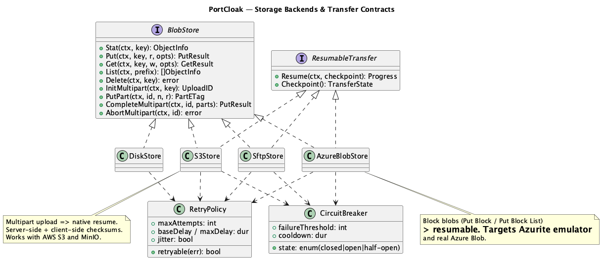

<!--
  Copyright 2026 Muhammad Salah
  SPDX-License-Identifier: Apache-2.0
-->

# 04 — Storage Backends (Storage backends)



*Source: [`07-storage-class.puml`](./diagrams/07-storage-class.puml) · [SVG](./diagrams/svg/07-storage-class.svg)*

Every backend implements `BlobStore`; the three network backends also implement
`ResumableStore` ([02 §2.4](./02-architecture.md)). The Orchestrator stores and retrieves the
sealed snapshot bundle through this one contract, so backend choice is just a configuration setting.

## 4.1 Shared behavior across all storage backends

- **Streaming.** `Put`/`Get` take `io.Reader`/`io.Writer`; the bundle is never fully buffered.
- **Integrity.** Client computes SHA-256 while streaming; where the backend supports
  server-side checksums (S3, Azure) they are cross-checked on completion.
- **Idempotent keys.** Snapshot object key = `portcloak/<realm>/<createdAt>-<snapshotID>.pck`
  plus a sidecar `<...>.manifest.json` (non-secret metadata subset) and `<...>.sha256`. Since a
  snapshot is single-realm (FR-S6), the realm prefix cleanly partitions the storage backend, so
  listing and access control can both be scoped per realm.
- **Resumability.** All network storage backends checkpoint progress so an interrupted upload/download
  resumes — even after PortCloak restarts (see [05](./05-resilience.md)).

## 4.2 Disk (FR-S1)

- **Layout:** a browsable tree under a chosen root:
  ```
  <root>/portcloak/<realm>/<timestamp>-<id>.pck
                          /<timestamp>-<id>.manifest.json
                          /<timestamp>-<id>.sha256
  ```
- **Writes:** write to `*.pck.tmp`, `fsync`, then atomic `rename` — a crash never leaves a
  half-file that looks complete (NFR-1/NFR-2).
- **Use cases:** air-gapped transfer, quick local backups, staging before pushing elsewhere.

## 4.3 Remote volume over SSH/SFTP (FR-S2)

- **Mechanism:** SFTP (`pkg/sftp`) over the same SSH stack as the SSH *target* — shared auth,
  bastion, and keychain handling.
- **Resume:** SFTP supports writing at an offset; checkpoint stores `{remotePath, bytesWritten}`
  and re-opens at that offset after a drop. Temp-name + rename for atomicity.
- **Integrity:** post-upload, request a remote `sha256sum` (if a shell is available) or re-read
  and hash; compare to the local digest.
- **Use cases:** pushing snapshots onto a hardened backup host or NAS reachable only by SSH.

## 4.4 S3-compatible (FR-S3)

- **Mechanism:** `aws-sdk-go-v2`. **Multipart upload** is the default for bundles over the part
  threshold (e.g. 8 MiB parts), which gives **native resume**: on interruption, PortCloak lists
  already-uploaded parts (or replays its checkpoint of `{uploadId, partNumber, etag}`) and
  continues, then `CompleteMultipartUpload`.
- **Checksums:** enable SHA-256 checksum on parts/object; compare to the local digest.
- **Compatibility:** custom endpoint + path-style addressing ⇒ works with **AWS S3 and MinIO**
  (and other S3-API stores). Region, credentials, and endpoint come from the storage definition (secrets in the OS keychain).
- **Cleanup:** `AbortMultipartUpload` on give-up so no orphan parts accrue cost.
- **Use cases:** durable central snapshot store, cross-team sharing, cloud DR.

## 4.5 Azure Blob / Azurite (FR-S4)

- **Mechanism:** `azure-sdk-for-go` blob client. **Block blobs**: `StageBlock` per chunk then
  `CommitBlockList`. Staged-but-uncommitted blocks give **resume** — re-stage only missing block
  IDs, then commit.
- **Azurite:** validated against the **Azurite emulator** by pointing the client at Azurite's
  endpoint/connection string (dev-storage account). The same code path serves real Azure Blob.
- **Integrity:** per-block MD5/CRC as supported + the client-side SHA-256 of the whole bundle.
- **Use cases:** Azure-centric orgs; local dev/testing of the Azure path without a cloud account.

## 4.6 Choosing and combining storage backends

- A capture job targets **exactly one storage**. PortCloak does not copy snapshots between
  storage backends; if a bundle is wanted in two places, it is captured to each, or moved with
  ordinary tools — the bundle is immutable and self-verifying, so an external copy still
  verifies.
- The bundle is checksummed *before* it reaches any storage backend, so **corruption is always caught on
  retrieval**, regardless of backend.
- **Storage trust depends on the encryption choice** ([06 §6.3](./06-snapshot-and-manifest.md)):
  - **Encrypted snapshot** — the storage backend is *untrusted*. A compromised or misconfigured bucket
    still cannot read secrets.
  - **Unencrypted snapshot** — the storage backend becomes *fully trusted*, because it now holds unmasked
    secrets and private signing keys in the clear. Bucket policy, SSE, disk encryption and SFTP
    file modes become the only protection. PortCloak warns at capture time and refuses to make
    this choice quietly.

## 4.7 Failure semantics (ties to [05](./05-resilience.md))

| Situation | Behavior |
|-----------|----------|
| Connection drops mid-upload | Checkpoint kept; resume from last completed part/block/offset. |
| App killed mid-upload | On relaunch, job is `Interrupted`; user resumes; multipart/blocklist re-listed. |
| Checksum mismatch on complete | Re-upload the offending part; if it persists, fail the job (no silent bad bundle). |
| Backend unreachable repeatedly | Circuit breaker opens; job pauses with a clear, resumable state — not a crash. |
| Partial/aborted upload abandoned | `AbortMultipart`/block cleanup so no cost/space leak. |

## 4.8 Why this meets the requirements

- One `BlobStore`/`ResumableStore` contract + four adapters ⇒ **FR-S1..S5** with uniform
  resume and integrity.
- Multipart (S3) and block-blob (Azure) and SFTP-offset resume ⇒ the storage half of **NFR-1**.
- Encrypt-then-store + checksum-tree ⇒ **NFR-2/NFR-3** hold regardless of backend trust.
