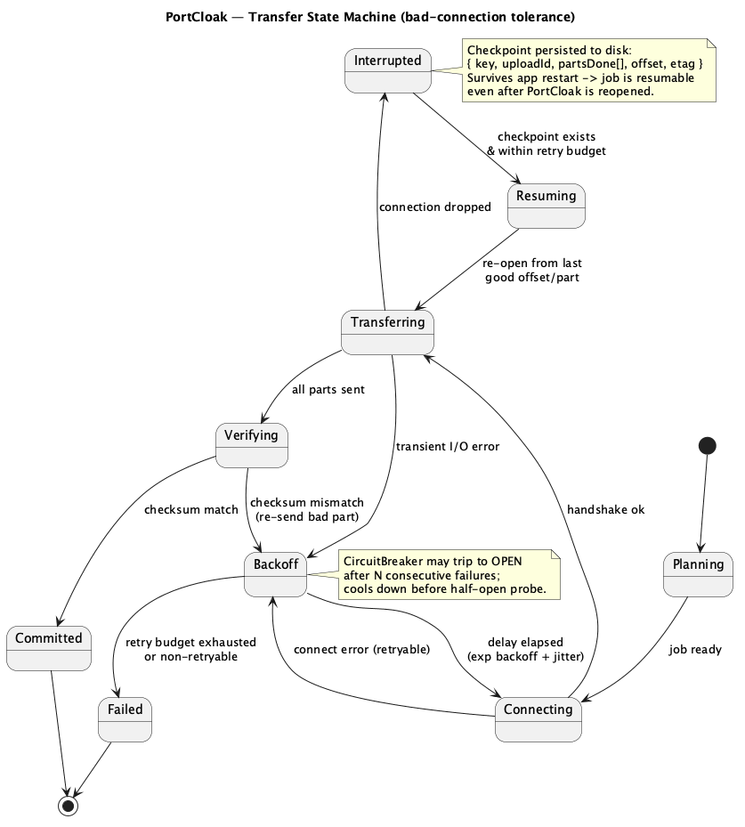

<!--
  Copyright 2026 Muhammad Salah
  SPDX-License-Identifier: Apache-2.0
-->

# 05 — Resilience: Tolerating Bad Connections



*Source: [`08-resilience-state.puml`](./diagrams/08-resilience-state.puml) · [SVG](./diagrams/svg/08-resilience-state.svg)*

The brief calls this out explicitly: **PortCloak must be very mindful of bad connections and
handle failed connections gracefully.** This is a first-class, cross-cutting concern — not
retry code sprinkled at call sites. Every remote operation (target exec, artifact fetch, admin
API, storage backend upload/download) flows through the `resil` layer.

## 5.1 Design stance

1. **Assume the connection will fail.** Flaky VPNs, bastions, mobile tethers, throttled cloud
   egress — these are the expected environment, not the exception.
2. **Never produce a bundle that looks complete but isn't.** Integrity is verified end-to-end;
   a failed transfer yields an explicit `Interrupted`/`Failed` state, never a truncated `.pck`
   masquerading as good.
3. **Make everything resumable, including across app restarts.** Job state is persisted, so
   closing PortCloak (or a crash) does not lose progress.
4. **Fail loud, fail actionable.** Errors carry the phase, the target/storage backend, and the suggested
   next step; the UI shows a Resume button, not a stack trace.

## 5.2 The building blocks

### Bounded retry with exponential backoff + jitter
- `RetryPolicy{ maxAttempts, baseDelay, maxDelay, jitter, retryable(err) }`.
- Only **retryable** errors retry: timeouts, connection resets, 5xx, throttling (429/503),
  SFTP/SSH channel drops. Non-retryable (auth failure, 404, bad request, checksum-after-resend)
  fail fast.
- Jitter prevents thundering-herd on shared backends.

### Circuit breaker
- Per target/storage backend endpoint: `closed → open → half-open`.
- After N consecutive failures, **open** and stop hammering a dead endpoint; after a cooldown,
  a **half-open** probe decides whether to close (recovered) or re-open.
- Protects both PortCloak (wasted work) and the remote (from a reconnect storm).

### Timeouts & keepalives
- Per-operation deadlines via `context.Context` (connect, first-byte, idle, overall).
- SSH/SFTP keepalives detect half-open TCP; HTTP clients set dial/response-header/idle timeouts.

### Checkpointing & resume
- Each long transfer persists a **checkpoint** to local disk:
  ```
  { jobID, phase, key, uploadId, partsDone[], byteOffset, etag, sha256State }
  ```
- Resume logic per backend:
  - **S3:** re-list/replay uploaded parts → continue → complete.
  - **Azure:** re-stage only missing block IDs → commit.
  - **SFTP:** re-open remote file at `byteOffset`.
  - **Target fetch (SSH/K8s/Docker):** re-fetch from the last fully-received artifact; per-user
    files make this granular.
- Because checkpoints are on disk, **the job resumes even after PortCloak is closed and
  reopened** (NFR-1, NFR-8).

### Streaming integrity
- SHA-256 is computed *while* streaming (rolling state persisted with the checkpoint), so a
  resumed transfer continues the hash rather than re-reading everything.
- On completion, local digest is compared to backend server-side checksum where available.

## 5.3 The transfer state machine

`Planning → Connecting → Transferring → Verifying → Committed`, with `Backoff`,
`Interrupted → Resuming`, and terminal `Failed`. Full diagram:
[`diagrams/08-resilience-state.puml`](./diagrams/08-resilience-state.puml). Key transitions:

- **Connecting → Backoff → Connecting:** connect errors back off and retry within budget.
- **Transferring → Interrupted → Resuming:** a mid-flight drop is caught, and if a checkpoint
  exists and budget remains, it resumes from the last good offset/part.
- **Verifying → Backoff:** a checksum mismatch re-sends only the bad part; persistent mismatch
  ⇒ `Failed` (never `Committed`).

## 5.4 Graceful degradation, not all-or-nothing

- **Per-realm isolation:** each realm is its own snapshot (FR-S6), so in a multi-realm capture
  run one realm failing has no effect on the others — there is no shared bundle to corrupt.
- **Verification is optional:** if the Admin API is unreachable, capture still completes via
  offline `kc.sh export` — which is the authoritative source anyway — and the completeness report
  records `secretVerification: skipped (admin API unreachable)`. The user gets a fully usable
  snapshot with an honest note, not a hard failure.
- **Clone teardown is never skipped:** if the job fails, is cancelled, or the app crashes, the
  ephemeral clone is still removed — by the deferred teardown path, by `ttlSecondsAfterFinished`,
  or by the orphan sweep on next launch ([03 §3.3](./03-capture-targets.md)).
- **Storage fallback:** if the primary storage is down, the user can retarget the *already-sealed*
  bundle to another storage without re-capturing (the expensive part is already done and on disk).

## 5.5 Partial-failure ledger

Every job carries a ledger of `{phase, item, attempts, lastError, outcome}` surfaced in the UI
and stored in the audit log. This is what turns "it failed" into "user file batch 7/40 failed
after 5 attempts (connection reset); resumable" — actionable and honest (NFR-5).

## 5.6 Why this meets the requirements

- Retry + backoff + circuit breaker + keepalive ⇒ transient drops are survived (**NFR-1**).
- Disk-persisted checkpoints ⇒ resume across restarts, idempotent convergence (**NFR-1/NFR-8**).
- Streaming integrity + server-side checksum cross-check ⇒ no silent corruption (**NFR-2**).
- Optional verification + per-snapshot isolation + storage fallback ⇒ graceful degradation, the
  explicit "handle failed connections gracefully" ask.
