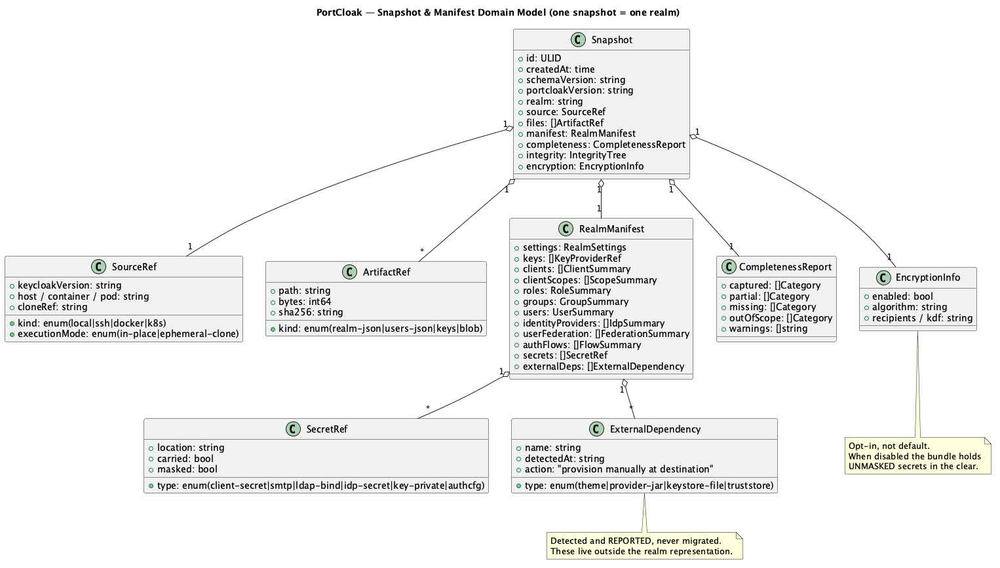
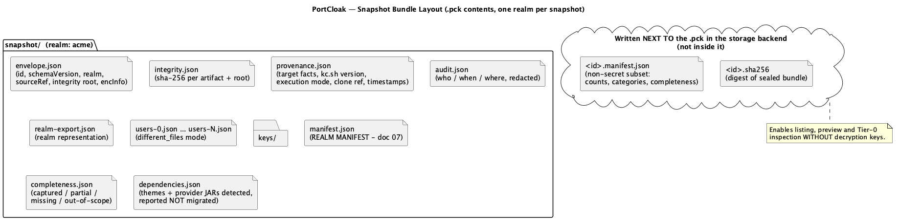
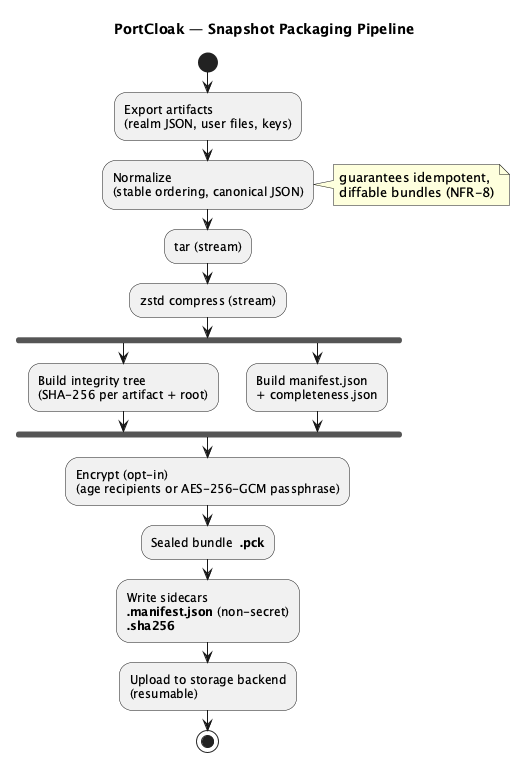

<!--
  Copyright 2026 Muhammad Salah
  SPDX-License-Identifier: Apache-2.0
-->

# 06 — Snapshot Bundle Format & Packaging

*Source: [`04-domain-model.puml`](./diagrams/04-domain-model.puml) · [SVG](./diagrams/svg/04-domain-model.svg)*

A **Snapshot** is the sealed, self-describing, integrity-protected unit PortCloak produces and
consumes. **One snapshot contains exactly one realm** (FR-S6) — capturing several realms yields
several independent snapshots, each separately restorable, verifiable and retainable. It is
designed so that a transfer can be resumed and a future PortCloak (or a careful human) can
understand exactly what is inside.

## 6.1 Bundle anatomy (`.pck`)

Logical layout inside the bundle (a tar stream, zstd-compressed, then optionally encrypted).
Because a snapshot is single-realm, the realm's artifacts sit at the root — there is no
`realms/<name>/` nesting to navigate:

*Source: [`11-bundle-layout.puml`](./diagrams/11-bundle-layout.puml) · [SVG](./diagrams/svg/11-bundle-layout.svg)*

Two sidecars are written *next to* the `.pck` in the storage backend (not inside it) so a snapshot can be
triaged without decrypting:

- `<id>.manifest.json` — a **non-secret** subset of the realm manifest (counts, categories,
  completeness) for listing/preview.
- `<id>.sha256` — the digest of the sealed `.pck`.

## 6.2 Packaging pipeline

*Source: [`10-packaging-pipeline.puml`](./diagrams/10-packaging-pipeline.puml) · [SVG](./diagrams/svg/10-packaging-pipeline.svg)*

- **Normalize:** stable file ordering + canonical JSON so identical inputs produce identical
  bundles (idempotence, NFR-8).
- **Integrity tree:** SHA-256 per artifact; a root hash over the sorted leaf digests. Restore
  recomputes and refuses on any mismatch (NFR-2).
- **Streaming:** the whole pipeline is `io.Reader`-chained — no full-bundle buffering (NFR-6).

## 6.3 Encryption — opt-in (detail in [08](./08-security.md))

- **Encryption is opt-in, not the default.** It is offered prominently at capture time and
  recommended in the UI, but a snapshot can be written unencrypted.
- Two modes when enabled: **passphrase** (AES-256-GCM via a strong KDF) or **recipients**
  (age/X25519 public keys, so multiple operators can decrypt with their own private keys).
- `encryption.enabled` is recorded in `envelope.json`, so tooling and the UI always know which
  kind of artifact they are holding.
- Only the bundle body is encrypted; `envelope.json`/sidecars carry **no secrets** either way, so
  listing and Tier-0 inspection work without keys.
- The manifest *inside* the bundle references secrets by *location and type*, never value; the
  actual secret values live only in the realm JSON.

> **Consequence of opting out.** An unencrypted `.pck` contains **unmasked client secrets, LDAP
> bind credentials, IdP secrets, SMTP passwords and RSA private signing keys in the clear**. It
> is as sensitive as the realm's database. Whoever holds the file effectively holds the realm.
> PortCloak therefore treats "encryption off" as a decision that must be made visibly: the
> capture wizard defaults the toggle to *on*, requires an explicit action to turn it off, marks
> such snapshots with a persistent warning badge in the library, and records the choice in the
> audit log. The storage backend also stops being untrusted — see [04 §4.6](./04-storage-backends.md).

## 6.4 Schema versioning

- `schemaVersion` on the envelope; `portcloakVersion` and the **source Keycloak version** in
  `provenance.json`.
- Restore checks compatibility (same/newer KC target) and warns on cross-version moves;
  transforming across incompatible KC schema changes is explicitly a non-goal ([01 §1.3](./01-vision-and-requirements.md)).

## 6.5 Why this format

- Self-verifying ⇒ corruption is always caught; **encrypted ⇒ the storage backend is untrusted** too
  ([04 §4.6](./04-storage-backends.md)).
- One realm per bundle ⇒ simpler layout, independently restorable per realm (**FR-S6**).
- Sidecar non-secret manifest ⇒ fast listing/preview without decryption (FR-M3, FR-R2).
- Per-realm subtree + completeness ⇒ partial success and honest gaps (FR-M2, [05 §5.4](./05-resilience.md)).
- Canonical/normalized ⇒ idempotent, diffable snapshots (NFR-8).
