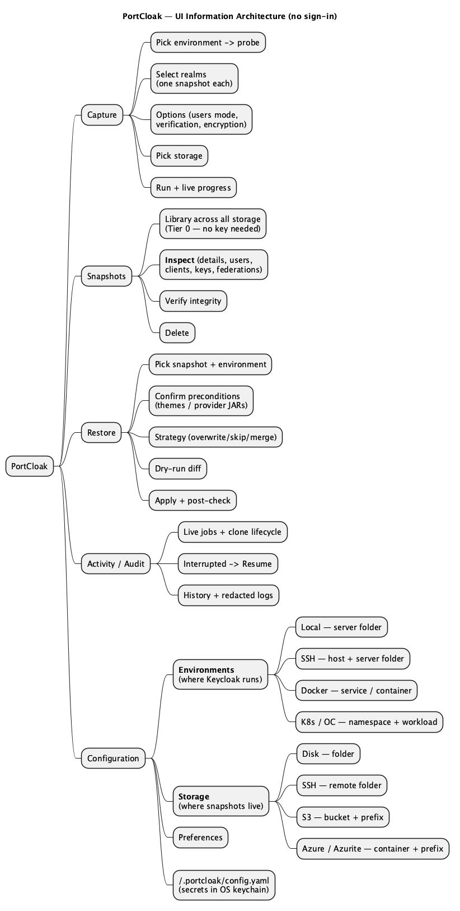
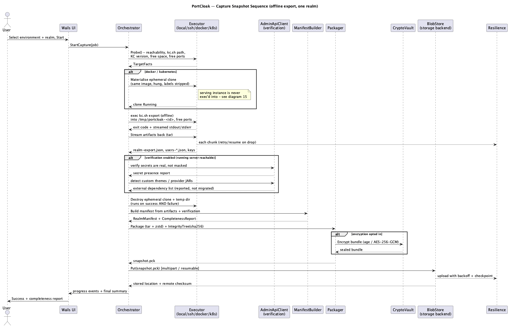
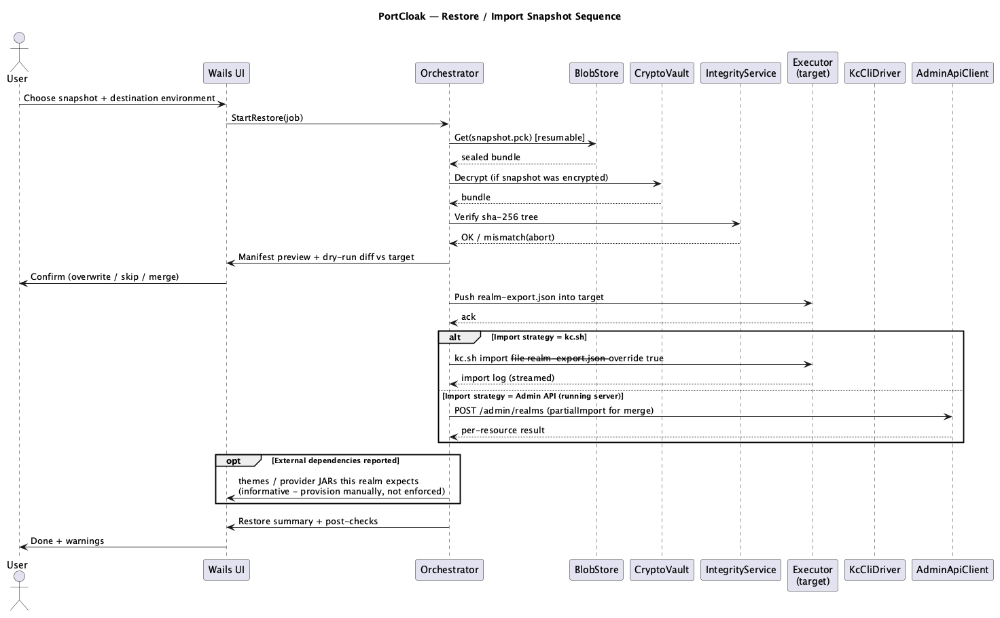

<!--
  Copyright 2026 Muhammad Salah
  SPDX-License-Identifier: Apache-2.0
-->

# 09 — Workflows & Wails UI

PortCloak is a guided desktop app. The UI's job is to make `kc.sh` fluency unnecessary and to
make resilience and fidelity *visible* — progress, gaps, and secrets are shown, not hidden.

There is **no sign-in** (N8). PortCloak opens straight into the workspace: it is a single-user
local tool, and the only credentials involved are the ones each environment and storage
definition carries.

## 9.1 Information architecture

*Source: [`12-ui-information-architecture.puml`](./diagrams/12-ui-information-architecture.puml) · [SVG](./diagrams/svg/12-ui-information-architecture.svg)*

## 9.1b Configuration: Environments, Storage and Keys

Three configuration screens hold everything PortCloak needs to reach the outside world and to
seal what it brings back. Environments and Storage are list-and-detail: a list of defined
entries on the left, a form on the right, and a **Test** action that reports a concrete pass/fail
rather than a silent save. Keys is a plain list, because a key has nothing to test.

### Environments — *where Keycloak runs*

An environment is an execution context PortCloak can capture from or restore to. Four kinds,
each asking only for what that kind actually needs:

| Kind | Fields |
|------|--------|
| **Local** | **Keycloak server folder** (install root containing `bin/kc.sh`) |
| **SSH** | Host, port, user, auth (key/agent/password), optional jump host, **Keycloak server folder** on the remote |
| **Docker** | Docker endpoint (socket / `DOCKER_HOST` / over-SSH), **service or container** running Keycloak, optional **path to `kc.sh`** inside the container |
| **Kubernetes / OpenShift** | Kubeconfig context and optional kubeconfig file, **namespace**, **Deployment or StatefulSet** running Keycloak, container name, optional **path to `kc.sh`** inside the pod |

Every kind also takes an optional **Admin API** block — base URL, user, credential, and an
**Accept a self-signed certificate** switch for an internal server behind a private CA
([08 §8.4](./08-security.md)). It is shown
in full from the start rather than revealed once a base URL is typed: this form does not redraw
per keystroke, so a field gated on another field's value is a field that cannot be filled.

The `kc.sh` path is empty for the official images, where PortCloak derives it. It exists because
deriving is guessing, and a custom-built image makes the guess wrong in a way that only surfaces
deep inside the export ([03 §3.6](./03-capture-targets.md)).

**Test** runs the same `Probe` the capture wizard uses ([03 §3.9](./03-capture-targets.md)), so
what you see here is exactly what a capture would find: Keycloak version, `kc.sh` location, free
space, whether an ephemeral clone can be created, and Admin API reachability.

### Storage — *where snapshots live*

A storage definition is a destination for snapshot bundles. Every kind is rooted at a
**folder / prefix**, so one bucket or one host can hold several independent snapshot trees:

| Kind | Fields |
|------|--------|
| **Disk** | Root **folder** |
| **SSH** | Host, port, user, auth, remote **folder** |
| **S3** | Endpoint, region, bucket, **prefix (folder)**, credentials |
| **Azure Blob / Azurite** | Account or endpoint, container, **prefix (folder)**, credentials |

One storage is marked **default** for new captures. Each also carries an **encryption required**
switch that removes the opt-out for snapshots written there ([08 §8.2](./08-security.md)).

### Keys — *what seals a snapshot and opens it again*

A third configuration screen, on the same terms. A key is an age keypair or a remembered
passphrase, generated or imported in-app; the secret half goes to the OS keychain and
`config.yaml` carries the name, the kind, the public half where there is one, and a handle.

The point of the screen is what it removes elsewhere. A capture seals to keys by name instead of
to pasted public keys, and a restore or inspection opens a snapshot with what is stored rather
than prompting — naming the key that worked, and keeping the key field as an override for the
snapshot sealed with something else ([08 §8.2](./08-security.md)).

Deleting a key asks for its name to be typed. Nothing PortCloak can see is using it; every
snapshot ever sealed with it is.

### Where this is persisted

All three lists live in `~/.portcloak/config.yaml` — readable, diffable, hand-editable — with every
credential held in the **OS keychain** and referenced by handle
([02 §2.6](./02-architecture.md)). Deleting an entry that something references is warned about,
not silently allowed.

## 9.1c Settings, and why it is not the audit log

A fourth configuration screen holds what PortCloak does to *itself*: where it keeps its files,
the ephemeral clones a crashed session left behind, and the working data sitting on this disk.

These three lived beside the audit log until they were moved. The screen that resulted was a
permanent record of what had happened with four buttons in it that make things happen, which is
two jobs and a confusing one. **Audit is a record**: read, filtered by action and time range,
never edited and never cleared from the app. **Settings is where things change.**

### Where PortCloak keeps its files

`~/.portcloak/` is the default, not a constant. The folder can be moved — onto an encrypted
volume, off a synced home directory, onto an external disk — and the resolution order is:

    PORTCLOAK_HOME  →  a folder chosen in the app  →  ~/.portcloak

`PORTCLOAK_HOME` is set outside the application and wins, so the screen reports the folder as
pinned and disables the move rather than offering something it cannot deliver. A chosen folder is
recorded in a one-line pointer in the OS's per-application settings directory — deliberately
*outside* the tree, because a note saying where the folder went cannot live in the folder that
went.

What moves is everything PortCloak wrote: `config.yaml`, the audit log, job checkpoints, logs,
inspection indexes and decrypted working files. What does not move is the OS keychain and every
snapshot in storage — moving this folder moves no backup and loses no credential, and the
confirmation says so before the folder is picked.

Two properties make it safe to offer at all:

- **Nothing starts until the destination has been refused for every reason it can be.** Relative,
  identical, inside the folder being moved, a parent of it, a file, non-empty, or with no parent
  to be created in. A move that fails halfway leaves an operator's environments, keys and
  checkpoints across two folders with the app bound to neither.
- **It is refused outright while a snapshot is open or a job is in flight**, because both hold
  paths under the old root for their whole lives. That refusal names the screen to go to.

The move then takes effect *without a restart*: the config store, job store, audit log, logger
and orchestrator are rebound behind the pointers the rest of the engine holds. A setting that
says one thing while the running application does another is worse than not offering it.

## 9.2 Capture workflow

*Source: [`05-capture-sequence.puml`](./diagrams/05-capture-sequence.puml) · [SVG](./diagrams/svg/05-capture-sequence.svg)*

1. **Choose source environment** from the configured list (Local / SSH / Docker / K8s). PortCloak **probes** and shows target
   facts (KC version, `kc.sh` path, free space, allocated free ports, whether an ephemeral clone
   can be created, admin-API reachability).
2. **Select realms.** Multi-select is allowed, but each realm produces its **own snapshot**
   (FR-S6) — the UI shows this as N queued jobs, not one bundle.
3. **Options:** users mode (`different_files` default), verification on/off (secret check +
   dependency detection), and **encryption** — the toggle is presented **on**, and turning it off
   requires an explicit confirmation that spells out the consequence.
4. **Choose storage** from the configured list; the one marked default is pre-selected.
5. **Run:** live progress per phase (probe → clone → export → fetch → verify → teardown →
   package → upload) with the **partial-failure ledger** and a Resume affordance if a connection
   drops. On Docker/K8s the clone's lifecycle is shown explicitly, so the operator can see it
   created and destroyed.
6. **Result:** completeness report, secret ledger, **external dependency list**, and where the
   snapshot landed.

## 9.3 Restore workflow

*Source: [`06-restore-sequence.puml`](./diagrams/06-restore-sequence.puml) · [SVG](./diagrams/svg/06-restore-sequence.svg)*

1. **Pick a snapshot** from the library (sidecar manifest previews without decrypting).
2. **Pick destination environment** (separate, higher-privilege).
3. **Decrypt (if encrypted) + verify** integrity; **preview manifest**; run a **dry-run diff**
   vs the target.
4. **Review preconditions** — the **external dependency list** (themes, provider JARs) is shown
   for information, because a realm referencing a missing theme or authenticator SPI imports
   cleanly and then fails at login (FR-D2). It does not gate the wizard: the Operator manages
   these environments and is assumed to know what is deployed where.
5. **Choose strategy:** overwrite / skip / merge (`partialImport` for merge on a running server).
   Restore is **whole-realm** — there is no cherry-picking (N6).
6. **Apply** via `kc.sh import` (offline) or Admin API (running); stream the import log.
7. **Post-check:** re-read target, compare counts + key KIDs to the manifest, report drift and
   restate what was out of scope (sessions — users will re-authenticate).

## 9.3b Inspect workflow

Snapshots are browsable artifacts, not black boxes: the library lists every snapshot across all
storage backends without decryption keys, and opening one reveals its realm detail, a searchable user
table, clients/keys/federations, and the secret ledger. Full design in
[10 — Snapshot Inspection](./10-snapshot-inspection.md).

Key UI affordances:
- **Library** — realm, date, source, counts, completeness badge (no keys needed).
- **Users tab** — paginated, searchable, faceted (enabled, origin, role, group, 2FA type).
- **Entities tabs** — clients (secret present?), keys (private carried?), IdPs, LDAP, flows,
  external dependencies.
- **Verify** — integrity check without touching any target.
- **Reveal** — explicit, audited, per-secret; redacted everywhere by default.

## 9.4 Making resilience visible

- Every long op shows **phase, item, attempts, last error, outcome** (the ledger from
  [05 §5.5](./05-resilience.md)).
- An interrupted job appears in **Activity** as `Interrupted — Resume` (survives app restart),
  not as a lost job.
- Circuit-breaker "paused, retrying in Ns" is shown rather than a spinning hang.

## 9.5 Making fidelity visible

- Completeness verdict badge: **Full / Partial / Gaps**, with `missing` (something went wrong)
  kept visually distinct from `outOfScope` (a design decision — sessions, theme files), so a
  healthy snapshot never looks broken.
- Secret ledger panel: counts by type, all value-free.
- Key panel: KIDs carried + a **"token continuity preserved"** indicator when the active signing
  key travels with the snapshot — this is the feature that stands in for session portability, so
  it is surfaced prominently rather than buried in the manifest.
- **Encryption badge:** encrypted snapshots show a lock; unencrypted ones carry a persistent
  warning that they hold unmasked secrets and private keys in the clear.

## 9.6 Wails specifics

- **Wails v3** is the target shell.
- **Bindings:** `CaptureController`, `RestoreController`, `SnapshotController`, `InspectController`,
  `ConfigController` expose Go methods to the frontend; nothing blocks — work runs in goroutines.
- **Events:** progress/log/ledger updates stream on one event, keyed by job id; the frontend
  subscribes once in the shell and routes.
- **The stream and the job record are two views of one truth**, and a screen needs both. Every
  phase announcement is written onto the job record as it happens, so a screen opened after the
  fact — or refreshed, or reopened after a crash — shows the same pipeline the live stream did.
  A batch of realms sharing one probe and one clone fans those events out to every job in it.
  Activity patches what the stream can reach, re-reads the list on anything structural, polls
  slowly while work is in flight, and repaints only when the shape changed.
- **Cancellation:** UI cancel maps to `context.Context` cancellation down the whole stack.
- **Cancellation** must also tear down an in-flight ephemeral clone — the cancel path runs
  `Teardown`, it does not merely abandon the job.
- **Single binary:** no external `ssh`/`kubectl`/`docker`/`aws` CLIs required (pure-Go SDKs,
  including a cgo-free SQLite), though CLI fallbacks are offered where a socket/API isn't exposed.

## 9.7 Requirement coverage

Fulfills **FR-R2/FR-R3** (dry-run + strategies), **FR-D2** (dependencies surfaced before import),
**FR-M3** (human-rendered manifest), **NFR-5** (observability/audit), and **G7** (usability), and
is the visible surface of the resilience and fidelity guarantees.
