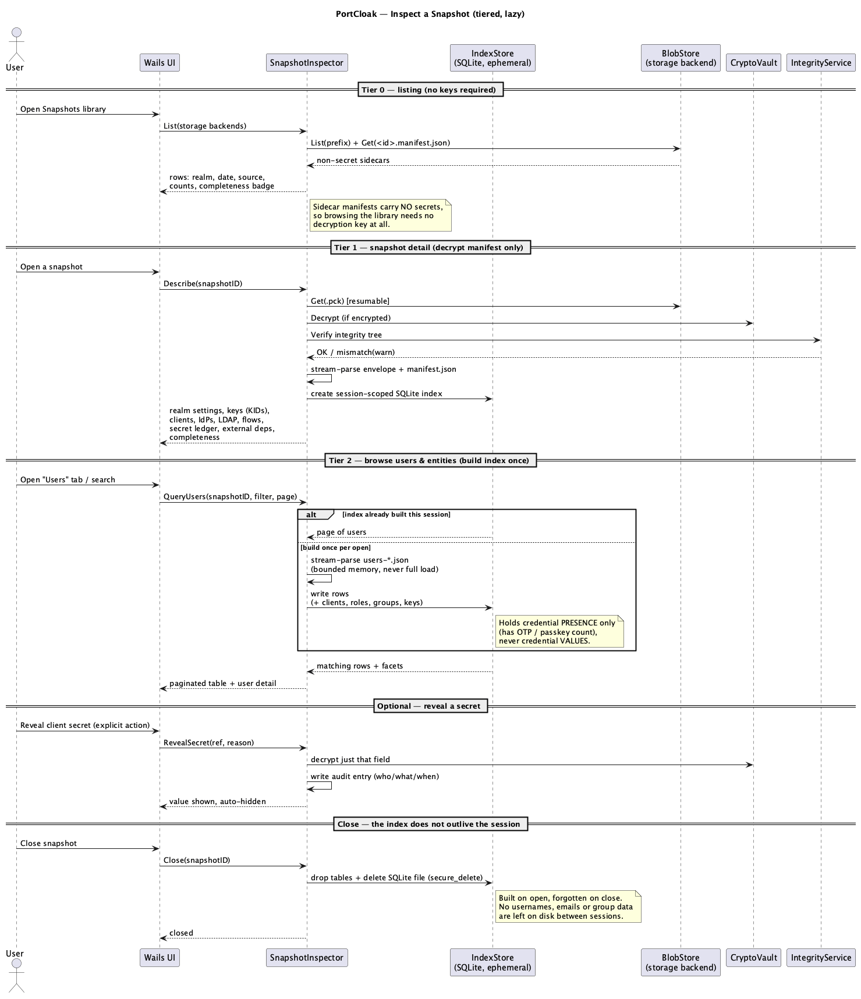
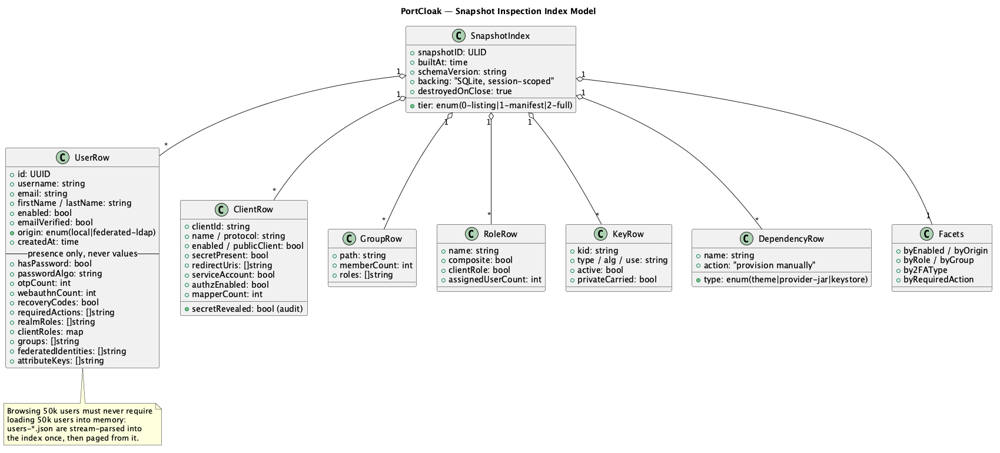

# 10 — Snapshot Inspection

A snapshot that can only be restored is a black box. PortCloak treats a snapshot as a
**queryable artifact**: you can open one, read exactly what it holds, page through its users,
search for a specific account, check which clients carry secrets, confirm the signing keys made
it, and diff it against another snapshot — all *before* deciding to restore anything.

*Source: [`13-inspect-sequence.puml`](./diagrams/13-inspect-sequence.puml) · [SVG](./diagrams/svg/13-inspect-sequence.svg)*

## 10.1 Why this matters

| Use case | What inspection answers |
|----------|------------------------|
| Pre-restore confidence | "Does this snapshot actually contain the 48k users and the active RSA key?" |
| Incident / rollback | "Which snapshot still has user `jdoe` enabled with their passkey?" |
| Pre-import preconditions | "Which themes and provider JARs must exist on the destination first?" |
| Audit & compliance | "List every secret this snapshot carries, and when one was revealed." |
| Troubleshooting a migration | "Was the LDAP bind credential captured, or is it the reason logins fail?" |

Without this, an operator's only way to see inside a snapshot is to restore it somewhere —
which is exactly the risky, slow operation they were trying to de-risk.

## 10.2 Three tiers of inspection

Inspection is **lazy and tiered** so that cheap questions stay cheap and keys are only needed
when genuinely required.

| Tier | Trigger | Source of truth | Needs decryption key? | Cost |
|------|---------|-----------------|:---------------------:|------|
| **0 — Listing** | Opening the Snapshots library | `<id>.manifest.json` sidecar in the storage backend | **No** | One small GET per snapshot |
| **1 — Detail** | Opening one snapshot | `envelope.json` + per-realm `manifest.json` inside the `.pck` | Yes | Download + decrypt + verify once |
| **2 — Full index** | Opening the Users tab, or searching | `users-*.json`, clients, roles, groups stream-parsed into a **session-scoped SQLite index** | Yes (already unlocked at Tier 1) | One index build per open, then instant |

Tier 0 is what makes the library usable at all: because the sidecar manifest is deliberately
**secret-free** ([06 §6.1](./06-snapshot-and-manifest.md)), an operator can survey every
snapshot across every storage backend — counts, completeness, provenance — without holding any key.

## 10.3 The snapshot index

*Source: [`14-inspection-model.puml`](./diagrams/14-inspection-model.puml) · [SVG](./diagrams/svg/14-inspection-model.svg)*

**Problem:** a realm export can hold hundreds of thousands of users spread across many
`users-N.json` files. Loading that into memory to render a table is not acceptable (NFR-9).

**Design:**
- On Tier-2 open, PortCloak **stream-parses** the user files (a streaming JSON decoder, one user
  object at a time — bounded memory regardless of realm size) and writes flattened rows into an
  **SQLite** index.
- The index holds **projections, not payloads**: the fields needed to list, search, sort and
  facet. Full detail for one user is fetched on demand from the decrypted bundle.
- **SQLite** is chosen for its indexed queries and **FTS** support, which is what makes
  substring search across 100k usernames and emails feel instant. The pure-Go driver
  (`modernc.org/sqlite`) keeps the desktop binary cgo-free and cross-compilable. SQLite is used
  **only** here — it is a disposable query accelerator, never a store of record.
- Index build is **cancellable** and reports progress like any other job.

### Lifecycle: built on open, destroyed on close (NFR-10)

The index is **session-scoped**. It is created when a snapshot is opened and **dropped and
securely deleted when the snapshot is closed** — no cross-session cache, no persistent copy.

- Written to its **own file** under `~/.portcloak/index/<snapshot-id>.sqlite`, with restricted
  permissions and `PRAGMA secure_delete` — **separate from the tool's own configuration**, which
  is never in SQLite at all ([02 §2.6](./02-architecture.md)). Deleting the whole `index/`
  directory at any moment is always safe.
- Destroyed on explicit close, on app exit, and swept on next launch if a crash prevented either.
- Small realms may be indexed entirely in memory, never touching disk at all.

**The trade-off, stated plainly:** re-opening the same snapshot pays the index build again.
That cost is accepted deliberately. An index is a searchable copy of a realm's entire user
directory — usernames, emails, group memberships — and leaving one lying on an operator's
workstation between sessions is a worse liability than a rebuild is an inconvenience. The build
streams and reports progress, so the cost is visible and bounded rather than surprising.

### What the index stores about credentials — and what it never stores

This is a deliberate boundary. The index records credential **presence and metadata**:

- `hasPassword` + `passwordAlgo` (e.g. `pbkdf2-sha512`, `argon2`) + iteration count
- `otpCount` — how many OTP/TOTP enrolments
- `webauthnCount` — how many passkeys / security keys
- `recoveryCodes` — present or not
- `requiredActions`, `origin` (local vs LDAP-federated), `enabled`, `emailVerified`

It **never** stores hash values, OTP seeds, passkey material, or any secret. Those stay only in
the encrypted realm JSON inside the bundle. So an operator can answer *"is this user's 2FA
going to survive the move?"* without the index ever becoming a second copy of the crown jewels.

## 10.4 Browsing users (FR-V3, FR-V4, FR-V5)

**List view** — paginated, sortable table: username, email, name, enabled, origin, 2FA badges,
groups, roles, created date.

**Search** — free-text across username, email, first/last name and user ID, served from the
index (prefix/substring matching), not by rescanning the bundle.

**Facets / filters** — computed once during index build and shown as counts:
- enabled / disabled
- origin: local vs LDAP-federated *(important: federated users may not be in the export at all —
  see [07 G](./07-realm-carryover-manifest.md))*
- by realm role, by client role, by group
- by second factor: none / OTP / passkey / both
- by pending required action

**User detail pane** — attributes, realm + client role mappings, group memberships, federated
identity links, required actions, and the credential-presence summary described above.

## 10.5 Browsing everything else (FR-V6)

The same index backs the other entity tabs:

| Tab | Shows | Notable column |
|-----|-------|----------------|
| **Clients** | clientId, protocol, enabled, public/confidential, redirect URIs, mappers, authz enabled | **`secretPresent`** — whether a usable secret was carried |
| **Client scopes** | name, protocol, mappers, default/optional assignment | |
| **Roles** | realm + client roles, composite flag, assigned-user count | |
| **Groups** | full path hierarchy, member count, role mappings | |
| **Identity providers** | alias, protocol, mappers | `secretCarried` |
| **User federation** | LDAP/Kerberos providers, mapper count, sync settings | `bindCarried` |
| **Keys** | KID, type, algorithm, use, active | **`privateCarried`** — the token-continuity indicator |
| **Auth flows** | flows, executions, bindings, authenticator configs | config secret present |
| **External deps** | detected themes, provider JARs, keystore files | `action: provision manually` — shown as a restore precondition |

## 10.6 Secret handling in inspection (FR-V7)

- Every secret is **redacted by default** in every view; the UI shows *presence*, never value.
- A **Reveal** action decrypts just that one field, displays it transiently (auto-hides,
  copy-to-clipboard), and writes an **audit entry**: what was revealed, when, and an optional
  reason. PortCloak is a single-user local tool with no login (N8), so the entry records the
  action and the machine, not an account.
- The **secret ledger** view ([07 §7.2](./07-realm-carryover-manifest.md)) lists every carried
  secret by type and location — safe to read, export and review wholesale.
- Reveal can be **disabled in preferences**, so an operator can keep inspection available while
  ruling out accidental secret extraction ([08 §8.7](./08-security.md)).

## 10.7 Verify without restoring (FR-V8)

A **Verify** action downloads (or reads a cached) bundle, decrypts it, recomputes the
integrity tree, and reports pass/fail per artifact — no target is touched. This turns
"is my backup good?" into a routine, safe check rather than a restore drill.

## 10.8 Exporting inspection views (FR-V10)

Any table view can be exported to CSV/JSON for audit trails and change-review tickets.
Exports are **redacted by the same rules as the UI** (presence, not values), and an export
action is itself audited. This keeps evidence-gathering from becoming an accidental
secret-exfiltration path.

## 10.9 Where it lives in the architecture

New engine components (see [02 §2.3](./02-architecture.md)):

| Module | Package | Responsibility |
|--------|---------|----------------|
| **Snapshot Inspector** | `engine/inspect` | Tiered open, stream-parse, query API (list/search/facet/detail). |
| **Index Store** | `engine/inspect/index` | Session-scoped SQLite projection store, one file per open snapshot; build on open, destroy on close. Isolated from tool configuration. |

The Inspector depends on `BlobStore` (fetch), `CryptoVault` (decrypt), and `IntegrityService`
(verify) — the same seams the capture and restore paths use, so nothing is duplicated.

## 10.10 Requirement coverage

Fulfills **FR-V1..FR-V8** and **FR-V10** (FR-V9 is withdrawn — snapshot comparison is out of
scope), plus **NFR-9** and **NFR-10**. It also strengthens **FR-D2** (external dependencies are
visible before import) and **FR-M3** (the manifest becomes explorable, not just readable).

Because a snapshot holds exactly one realm (**FR-S6**), every view in this document is
unambiguously scoped — there is no realm selector to get wrong.
