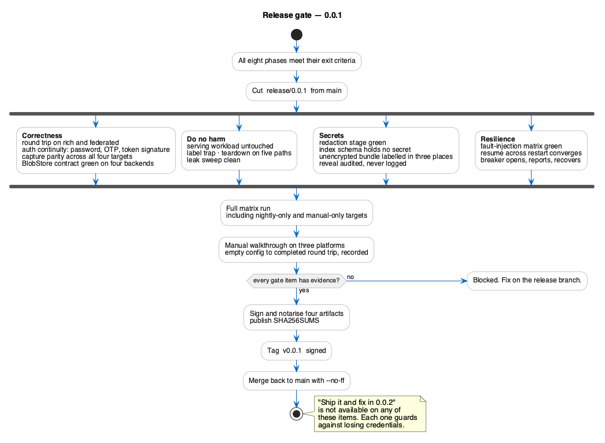

<!--
  Copyright 2026 Muhammad Salah
  SPDX-License-Identifier: Apache-2.0
-->

# Release — 0.0.1

**What 0.0.1 is.** The first version where the whole loop closes: capture a realm from any of the
four target kinds, store it in any of the four storage backends, read it back without restoring
it, and restore it into a target that then works — same passwords, same OTP, same token signatures.

It is a first release. The list of what it does not do is below, stated plainly, because a
migration tool that oversells itself is worse than one that is narrow.

---

## Release gate

*Source: [`r-04-release-gate.puml`](./diagrams/r-04-release-gate.puml) · [SVG](./diagrams/svg/r-04-release-gate.svg)*

All eight phases complete, plus the cross-cutting checks below. Nothing here is optional; a
"ship it and fix in 0.0.2" on any of these items would ship a tool that can lose credentials.

### Correctness

- [ ] Every phase's exit criteria met.
- [ ] Every row in [12 — Rollout traceability](./12-rollout-traceability.md) carries evidence.
- [ ] The full fidelity round trip passes on `rich` and `federated`: capture → restore →
      re-export → identical inventory.
- [ ] The authentication continuity check passes: a source user logs in at the destination with
      the same password and the same TOTP, and a token signed before the move verifies after it.
- [ ] Capture parity: the same realm through all four targets yields identical inventories.
- [ ] `BlobStore` contract suite green across all four backends.

### Do no harm

- [ ] The serving workload is provably untouched across every clone capture and clone restore.
- [ ] The label trap test passes on Kubernetes, and the network-alias equivalent on Docker.
- [ ] Teardown proven on all five exit paths, on both clone platforms, for both capture and restore.
- [ ] The end-of-run leak sweep is clean across the entire integration suite.

### Secrets

- [ ] The redaction CI stage is green, covering logs, audit entries, progress events, exported
      views and sidecar files.
- [ ] `TestIndexSchemaHasNoSecretColumns` passes.
- [ ] `config.yaml` produced by a full manual walkthrough contains no secret material.
- [ ] An unencrypted bundle is labelled in the library, the manifest and the completeness report.
- [ ] Reveal writes an audit entry and never logs the value.

### Resilience

- [ ] The fault-injection matrix is green for every transport.
- [ ] A job resumes across an app restart and converges byte-identically.
- [ ] The circuit breaker opens, reports plainly, and recovers unaided.

### Build and packaging

- [ ] Signed and notarised macOS `.app` (universal), Linux `AppImage` and `.tar.gz`, Windows
      `.exe` signed.
- [ ] Each artifact launches on a clean machine with no toolchain installed.
- [ ] `SHA256SUMS` published alongside.
- [ ] Version, commit and build date embedded and shown in the app.

### Documentation

- [ ] `README.md` at the repository root: what it is, what it does not do, how to install.
- [x] The spec matches the shipped behaviour — any drift resolved in favour of correcting whichever
      is wrong, not by quietly leaving both.
- [ ] `CHANGELOG.md` opened at 0.0.1.
- [ ] A one-page "first migration" walkthrough.

---

## What 0.0.1 does not do {#what-001-does-not-do}

Carried forward from the non-goals in [01 §1.3](../01-vision-and-requirements.md), restated as
release notes because this is the list a user needs before trusting the tool:

| Not in 0.0.1 | Why |
|---|---|
| **Sessions** | Out of scope ([D1](../12-decisions.md), N5). Users re-authenticate after a move. Token continuity is delivered instead by carrying the realm's signing keys — tokens issued before the move still verify after it. |
| **Themes and provider JARs** | Detected and reported, never migrated ([D4](../12-decisions.md), N7). They live outside the realm representation and must be provisioned at the destination deliberately. |
| **Selective restore** | Whole-realm only ([D3](../12-decisions.md), N6). Cherry-picking users or clients invites partial-state hazards. |
| **Multi-realm bundles** | One snapshot is one realm ([D5](../12-decisions.md)). Capturing several realms produces several snapshots. |
| **Snapshot comparison** | Out of scope (FR-V9 withdrawn). The pre-restore dry-run diff against a live target realm remains. |
| **Retention policies and storage mirroring** | Not PortCloak's job. Use the storage backend's own lifecycle controls — S3 lifecycle rules, Azure management policies. |
| **Cross-version realm transformation** | Not an upgrader (N2). Version deltas are reported, not fixed. |
| **Continuous replication** | Point-in-time snapshots only (N1). |
| **Multi-user, accounts, roles** | Single-user local tool (N8). No sign-in; the audit trail records what happened and when, not who. |

One consequence deserves its own line, because it is the sharpest edge in the tool: **an
unencrypted snapshot contains unmasked client secrets and private signing keys in the clear.**
That is by design — Keycloak accepts those values on import, which is what makes the migration
work at all. Encryption is offered prominently at capture time. If it is declined, the file is
as sensitive as the realm it came from, and PortCloak does not expire it, because it has no
retention policy. Where the file goes afterwards is the operator's responsibility.

---

## Release procedure

1. **Freeze.** Cut `release/0.0.1` from `main`. Only fixes for gate failures land on it.
2. **Full matrix run.** The complete integration and fault-injection suite, including the fixtures
   that are normally nightly (`large`) and the manual-only targets (real S3, a real Azure account,
   an OpenShift cluster).
3. **Manual walkthrough** on all three platforms, from empty config to a completed round trip.
   Recorded, and attached to the release.
4. **Gate review.** Every checkbox above, with its evidence. An unchecked box blocks the release.
5. **Tag.** `git tag -a v0.0.1 -m "..."` on the release commit, signed.
6. **Build and publish** the four artifacts plus `SHA256SUMS` from the tag.
7. **Merge back** to `main` with `--no-ff`.

## Version stamping

`cmd/portcloak` embeds version, commit and build date via `-ldflags`. The version shown in the
app and written into every snapshot envelope is the tag, so a bundle can always be traced to the
build that wrote it. This matters more than it looks: when a bundle written today is opened in
three years, the envelope is the only record of what produced it.

## After 0.0.1

Not commitments — the candidates that the first release will have earned an opinion about:

- The three items listed as [decisions still open](../12-decisions.md#decisions-still-open),
  which 0.0.1 exists to inform.
- Additional target kinds (`podman`, `nerdctl`), which the `Executor` registry makes additive.
- Additional storage backends (GCS), likewise additive behind `BlobStore`.
- Whatever the first real migration proves to be missing — which is the only requirements source
  more reliable than the spec.
