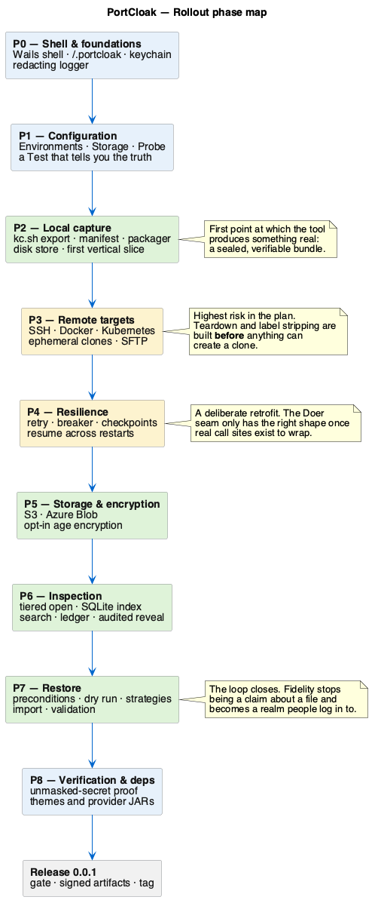
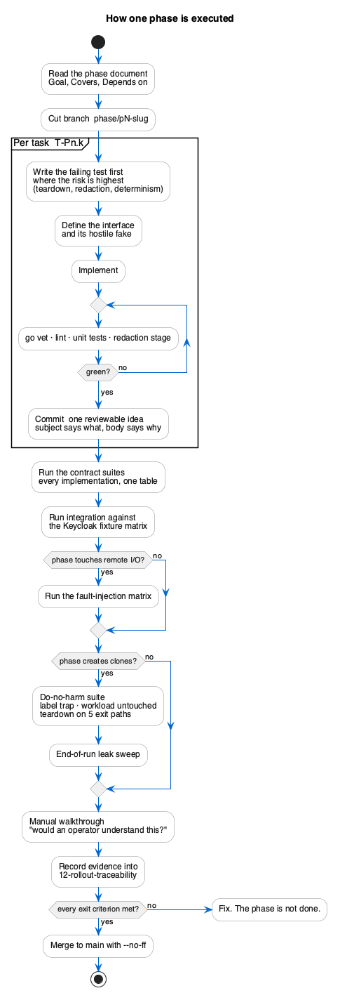

<!--
  Copyright 2026 Muhammad Salah
  SPDX-License-Identifier: Apache-2.0
-->

# Rollout Plan

How PortCloak gets built. [The specification](../README.md) says *what* the tool is; this
folder says *in what order it comes into existence*, *what code gets written first*, and
*how each step is proved before the next one starts*.

The plan is deliberately **vertical**. Each phase ends with something an operator could sit
down in front of and use, not with a layer that only makes sense once the next layer lands.
The reason is specific to this tool: PortCloak's hardest problems — a serving Keycloak that
must not be disturbed, a connection that drops mid-transfer, a secret that arrives masked —
only show themselves against a *real* Keycloak. A horizontal build (all adapters, then all
storage, then all UI) would defer every one of those discoveries to the end.

## Phases at a glance

*Source: [`r-01-phase-map.puml`](./diagrams/r-01-phase-map.puml) · [SVG](./diagrams/svg/r-01-phase-map.svg)*

| Phase | Name | What becomes true at the end | Doc |
|-------|------|------------------------------|-----|
| **P0** | Shell & foundations | The app starts, owns `~/.portcloak/`, logs without leaking secrets. | [P0](./02-phase-p0-shell.md) |
| **P1** | Configuration | Environments and storage definitions can be created, tested and persisted. | [P1](./03-phase-p1-configuration.md) |
| **P2** | Local capture | A realm on this machine becomes a sealed, checksummed bundle on disk. | [P2](./04-phase-p2-local-capture.md) |
| **P3** | Remote targets | The same capture works over SSH, and inside ephemeral Docker/Kubernetes clones. | [P3](./05-phase-p3-remote-targets.md) |
| **P4** | Resilience | A dropped connection costs seconds, not the whole job. | [P4](./06-phase-p4-resilience.md) |
| **P5** | Storage & encryption | Bundles land in S3 and Azure Blob, optionally encrypted. | [P5](./07-phase-p5-storage-and-crypto.md) |
| **P6** | Inspection | A snapshot can be read — users, clients, keys, secrets — without restoring it. | [P6](./08-phase-p6-inspection.md) |
| **P7** | Restore | A bundle becomes a live realm on a target of the operator's choosing. | [P7](./09-phase-p7-restore.md) |
| **P8** | Verification & dependencies | Secrets are proven unmasked; themes and provider JARs are reported. | [P8](./10-phase-p8-verification.md) |
| **R** | Release 0.0.1 | Signed binaries, a tagged commit, and an honest list of what 0.0.1 does not do. | [Release](./11-release-0.0.1.md) |
| **R2** | Release 0.0.2 | What the first maintenance release changes, and the one option in it that carries a trade. | [Release](./13-release-0.0.2.md) |

Supporting documents:

- **[00 — Engineering foundations](./00-engineering-foundations.md)** — repository layout, toolchain,
  package boundaries, coding and commit conventions, CI.
- **[01 — Test strategy](./01-test-strategy.md)** — the test taxonomy, the Keycloak fixture matrix,
  fault injection, and how each class of requirement is actually proved.
- **[12 — Rollout traceability](./12-rollout-traceability.md)** — every use case and every
  requirement mapped to the phase that delivers it, plus the reverse check.

## Five rules the plan follows

**1. Interfaces before implementations, but never more than one implementation ahead.**
`Executor` and `BlobStore` are defined in P2 with exactly one implementation each (Local, Disk).
The second implementation — SSH in P3 — is what proves the interface was right. Designing a
four-way abstraction before writing the second implementation is how the wrong seams get set
in concrete.

**2. The dangerous path is exercised early.** Ephemeral clone teardown (P3) is the single
riskiest behaviour in the tool: a leaked pod in a production namespace is a real operational
incident. It is built in the third phase, not the eighth, and the teardown test is written
before the clone-creation code.

**3. Resilience is retrofitted deliberately, not designed in from the start.** P2 and P3
call remote I/O directly. P4 wraps it. This looks backwards, and it is intentional: the
`Doer` seam only has the right shape once several real call sites exist to wrap. The cost is
one focused refactor in P4; the alternative is speculative retry logic threaded through code
that has never failed.

**4. Nothing ships that lies about itself.** Every phase includes the negative cases —
the masked secret, the truncated transfer, the missing theme. A completeness report that
reads "complete" when a category was skipped is a worse outcome than a failed capture.

**5. Secrets are handled as if the tool were already in production.** From P0 the log handler
redacts, and PortCloak's own credentials go to the OS keychain. There is no "we'll add
redaction later" window, because test output and crash logs from the earliest phases are
exactly where a real bind password would first escape.

## What a phase looks like

Every phase document has the same shape, so a phase can be picked up without reading the
others:

| Section | What it answers |
|---------|-----------------|
| **Goal** | What becomes true, in one paragraph. |
| **Covers** | The use cases and requirements this phase delivers. |
| **Depends on** | Which earlier phases must be complete. |
| **Packages** | What Go packages are created or changed. |
| **Tasks** | `T-Pn.k` — the ordered coding tasks, each with a *done when*. |
| **Testing** | Unit, integration and manual tests, and what each one is actually testing. |
| **Verification** | Requirement → the evidence that proves it. Not "we wrote code", but "here is the artifact". |
| **Demo** | What you can show someone at the end of the phase. |
| **Exit criteria** | The checklist that lets the next phase start. |
| **Commits** | The expected commit sequence, so history stays readable. |
| **Risks** | What is most likely to go wrong, and the mitigation. |

*Source: [`r-02-phase-anatomy.puml`](./diagrams/r-02-phase-anatomy.puml) · [SVG](./diagrams/svg/r-02-phase-anatomy.svg)*

## Definition of done — for any task

A task is done when **all** of the following hold. This is uniform across phases and is not
restated in each one.

1. The code compiles and `go vet ./...` and the linter are clean.
2. Unit tests cover the success path **and** the named failure paths for that task.
3. Any new remote I/O has a fake implementation used by tests — no test reaches the network.
4. No secret value can reach a log line, verified by the redaction test (see [01](./01-test-strategy.md#redaction)).
5. Anything the operator sees — a status, an error, a report field — reads as a plain sentence
   about their system, not as an internal state name.
6. The requirement rows in [12](./12-rollout-traceability.md) that the task claims are marked
   with the evidence that proves them.
7. The work is committed with a message that says *why*, following [00 §0.6](./00-engineering-foundations.md#06-commit-and-branch-conventions).

## What 0.0.1 is

0.0.1 is the first version where the whole loop closes: **capture a realm, put it somewhere,
read it back, and restore it.** All four target kinds, all four storage backends, inspection,
and restore. It is a first release, not a mature one — the honest list of its limits lives in
[11 — Release 0.0.1](./11-release-0.0.1.md#what-001-does-not-do).
