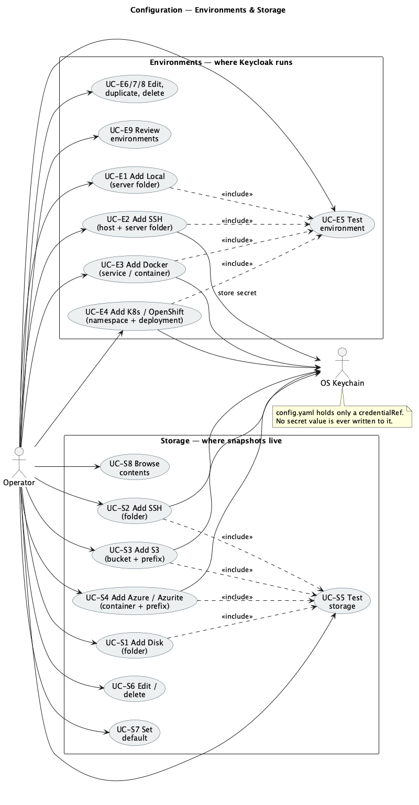

# 01 — Environments

> An **Environment** is a configured Keycloak execution context — where a Keycloak server
> actually runs. PortCloak captures *from* environments and restores *into* them.
> Configuration is persisted to `~/.portcloak/config.yaml`; credentials go to the OS keychain.

*Source: [`uc-02-configuration.puml`](./diagrams/uc-02-configuration.puml) · [SVG](./diagrams/svg/uc-02-configuration.svg)*

## Environment kinds and their fields

| Kind | Required fields | Optional |
|------|-----------------|----------|
| **Local** | Name, **Keycloak server folder** (install root containing `bin/kc.sh`) | Java home override |
| **SSH** | Name, host, port, user, auth method, **Keycloak server folder** on the remote | Jump/bastion host, sudo, keepalive tuning |
| **Docker** | Name, Docker endpoint, **service or container** running Keycloak | Network override, registry pull secret |
| **Kubernetes / OpenShift** | Name, kubeconfig context, **namespace**, **Deployment or StatefulSet** | Container name, resource preset, node selector passthrough |

---

## UC-E1 — Add a Local environment

**Goal.** Register a Keycloak installation on this machine so it can be captured from.
**Primary actor.** Operator. **Trigger.** Operator chooses *Environments → Add → Local*.

**Preconditions.** None.

**Main success scenario**
1. Operator enters a name and selects the **Keycloak server folder**.
2. PortCloak verifies the folder exists and contains `bin/kc.sh` (or `bin/kc.bat` on Windows).
3. PortCloak reads the Keycloak version from the installation.
4. Operator triggers **Test**; PortCloak runs `Probe` (UC-E5) and shows the result.
5. Operator saves. The entry is written to `config.yaml`.

**Alternate flows**
- **A1 — Folder chosen by browsing.** Operator uses a native folder picker instead of typing.
- **A2 — Save without testing.** Permitted; the entry is marked *Untested* in the list.
- **A3 — Keycloak not currently running.** Fine — offline export does not need it running.

**Exceptions**
- **E1 — `bin/kc.sh` not found.** PortCloak names the exact path it looked for and refuses to
  mark the environment valid. Save is still allowed so the Operator can correct it later.
- **E2 — Folder unreadable.** Permission error is surfaced verbatim with the path.

**Postconditions.** A Local environment exists and is selectable in the capture wizard.
**Covers.** FR-N1, FR-N3, FR-C1.

---

## UC-E2 — Add an SSH environment

**Goal.** Register a Keycloak running on a remote host reachable over SSH.
**Trigger.** *Environments → Add → SSH*.

**Preconditions.** Network reachability to the host (possibly via a jump host).

**Main success scenario**
1. Operator enters name, host, port, and user.
2. Operator selects an auth method — private key (with optional passphrase), SSH agent, or
   password — and supplies it.
3. PortCloak stores the secret in the **OS keychain** and records only a `credentialRef` in
   `config.yaml`.
4. Operator enters the **Keycloak server folder** on the remote host.
5. Operator triggers **Test**: PortCloak connects, verifies `bin/kc.sh` at that folder, reads the
   Keycloak version, checks free space in the temp directory, and probes for free ports.
6. Operator saves.

**Alternate flows**
- **A1 — Jump/bastion host.** Operator adds an intermediate host; the chain is tested end to end.
- **A2 — `sudo` required.** Operator marks that `kc.sh` needs elevation; `Probe` verifies the
  Operator can actually obtain it non-interactively.
- **A3 — Agent auth.** No secret is stored; PortCloak records that the agent is to be used.

**Exceptions**
- **E1 — Host unreachable.** Reported as a connection failure with host, port and cause; the
  entry saves as *Untested*.
- **E2 — Authentication rejected.** Reported as **non-retryable** — PortCloak does not retry bad
  credentials ([05 §5.2](../05-resilience.md)).
- **E3 — Server folder wrong.** The remote path checked is named explicitly.
- **E4 — Insufficient free space.** `Probe` reports available vs the estimated export size.

**Postconditions.** An SSH environment exists; its secret lives only in the keychain.
**Covers.** FR-N1, FR-N3, FR-N6, FR-C2, FR-C10.

---

## UC-E3 — Add a Docker environment

**Goal.** Register a Keycloak running as a Docker container/service.
**Trigger.** *Environments → Add → Docker*.

**Preconditions.** Docker endpoint reachable (local socket, `DOCKER_HOST` over TLS, or
Docker-over-SSH).

**Main success scenario**
1. Operator enters a name and the Docker endpoint.
2. PortCloak lists running containers, highlighting likely Keycloak ones by image and labels.
3. Operator selects the **service/container** running Keycloak.
4. Operator triggers **Test**: PortCloak inspects the container (read-only) to read its image,
   environment, networks and mounts, reads the Keycloak version, and confirms it can **create and
   destroy an ephemeral clone**.
5. Operator saves.

**Alternate flows**
- **A1 — Container not running.** Operator may still select it by name; capture will fail the
  precondition until it exists, and the test says so.
- **A2 — Podman / nerdctl.** Selected as the runtime; PortCloak uses the CLI fallback path.
- **A3 — Remote Docker.** `DOCKER_HOST` over TLS or SSH; the same resilience layer applies.

**Exceptions**
- **E1 — Docker socket not accessible.** Reported with the endpoint tried and the permission hint.
- **E2 — Image not present locally.** Clone creation would fail; `Probe` reports this **before**
  a capture is attempted ([03 §3.6](../03-capture-targets.md)).
- **E3 — Cannot create containers.** The exact API error is surfaced; the environment is marked
  as unable to capture.

**Postconditions.** A Docker environment exists, tested for clone feasibility.
**Covers.** FR-N1, FR-N3, FR-C3, FR-C9.

---

## UC-E4 — Add a Kubernetes / OpenShift environment

**Goal.** Register a Keycloak running as a Deployment or StatefulSet in a cluster.
**Trigger.** *Environments → Add → Kubernetes / OpenShift*.

**Preconditions.** A kubeconfig (or `oc` login) with access to the namespace.

**Main success scenario**
1. Operator enters a name and picks a **kubeconfig context**.
2. Operator picks a **namespace** from the list PortCloak can see.
3. Operator picks the **Deployment or StatefulSet** running Keycloak.
4. Operator triggers **Test**: PortCloak reads the workload spec (read-only), reads the Keycloak
   version, and verifies the **RBAC verbs required for an ephemeral clone** —
   `create`/`get`/`list`/`delete` on `jobs` and `pods`, and `create` on `pods/exec` — plus
   namespace `ResourceQuota` headroom.
5. Operator saves.

**Alternate flows**
- **A1 — OpenShift.** Same API path; the `oc` login context is honoured and the workload's
  `securityContext` is preserved so the clone satisfies the same SCC.
- **A2 — Operator-managed Keycloak CR.** PortCloak resolves the CR to its underlying StatefulSet.
- **A3 — Explicit container name.** Multi-container pods let the Operator name the Keycloak one.
- **A4 — Resource preset.** Operator may override the clone's CPU/memory instead of inheriting.

**Exceptions**
- **E1 — RBAC insufficient.** PortCloak lists **exactly which verbs are missing** rather than
  failing generically.
- **E2 — Quota exhausted.** Reported now, not mid-capture.
- **E3 — `PodSecurity` admission would reject the clone.** The specific policy violation is shown.
- **E4 — Exec disabled by policy.** Environment marked unable to capture, with the suggestion to
  capture instead from a host with database access.

**Postconditions.** A Kubernetes environment exists, verified for clone creation.
**Covers.** FR-N1, FR-N3, FR-C4, FR-C9.

---

## UC-E5 — Test an environment

**Goal.** Confirm an environment still works, before relying on it.
**Trigger.** *Test* on an environment, or automatically at the start of a capture.

**Main success scenario**
1. PortCloak runs `Probe` against the environment.
2. It reports `TargetFacts`: Keycloak version, `kc.sh` path, free space, allocated free ports,
   ephemeral-clone feasibility, and Admin API reachability.
3. The environment is stamped *Tested OK* with a timestamp.

**Alternate flows**
- **A1 — Admin API unreachable.** Not a failure: the test passes with a note that secret
  verification and dependency detection will be skipped ([05 §5.4](../05-resilience.md)).

**Exceptions**
- **E1 — Any probe check fails.** The environment is marked *Failed* with the specific check and
  a suggested fix. Nothing is retried behind the Operator's back for auth failures.

**Postconditions.** Test status and timestamp recorded. No change to the target.
**Covers.** FR-N3, FR-C7, FR-C10.

---

## UC-E6 — Edit an environment

**Goal.** Change a hostname, folder, workload or credential.

**Main success scenario**
1. Operator opens the environment and edits fields.
2. If a credential changed, the old keychain entry is replaced; `config.yaml` keeps only the ref.
3. The *Tested OK* stamp is **cleared** — an edited environment is untested by definition.
4. Operator saves and may re-Test.

**Exceptions**
- **E1 — Edited while a job is using it.** PortCloak warns and applies the change only to
  **future** jobs; the running job keeps the values it started with.

**Postconditions.** Updated definition; stale test status cleared.
**Covers.** FR-N4.

---

## UC-E7 — Duplicate an environment

**Goal.** Create a near-identical environment (e.g. staging from prod) without re-entering
everything.

**Main success scenario**
1. Operator chooses *Duplicate*.
2. All non-secret fields are copied; the name gets a suffix; **credentials are not copied**.
3. Operator supplies credentials for the new environment and saves.

**Postconditions.** A new environment exists; no secret was silently reused.
**Covers.** FR-N4, FR-N6.

---

## UC-E8 — Delete an environment

**Goal.** Remove an environment that is no longer needed.

**Main success scenario**
1. Operator chooses *Delete* and confirms.
2. PortCloak deletes the entry and **removes its keychain secret**.

**Alternate flows**
- **A1 — Referenced by history.** Past snapshots record the environment in their provenance;
  those records are immutable and keep the name as captured. Deletion does not rewrite history.

**Exceptions**
- **E1 — A job is currently using it.** Deletion is refused until the job finishes or is
  discarded.

**Postconditions.** Environment gone; keychain entry removed; snapshot provenance unaffected.
**Covers.** FR-N4.

---

## UC-E9 — Review environments at a glance

**Goal.** See every configured environment and whether it is usable.

**Main success scenario**
1. Operator opens *Environments*.
2. Each row shows name, kind, target (folder / container / namespace+workload), Keycloak version
   last seen, test status with timestamp, and whether ephemeral clone execution is available.

**Postconditions.** No change. Read-only.
**Covers.** FR-N1, FR-N3.
