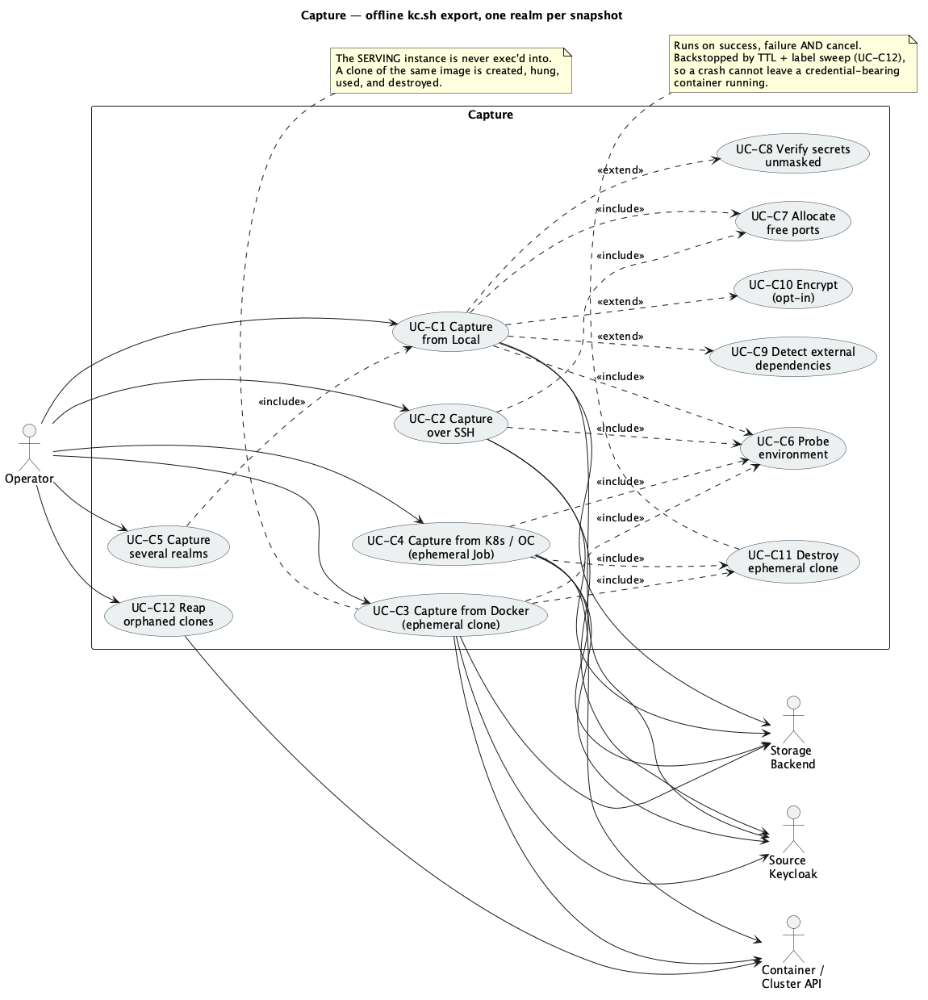

# 03 — Capture

> Capture produces a **snapshot**: one sealed, checksummed, optionally encrypted bundle
> containing **exactly one realm** (FR-S6). The authoritative mechanism is **offline
> `kc.sh export`**, and on Docker/Kubernetes it runs inside an **ephemeral clone** so the serving
> instance is never touched (FR-C9).

*Source: [`uc-03-capture.puml`](./diagrams/uc-03-capture.puml) · [SVG](./diagrams/svg/uc-03-capture.svg)*

---

## UC-C1 — Capture a realm from a Local environment

**Goal.** Produce a snapshot of one realm from Keycloak installed on this machine.
**Preconditions.** A Local environment exists (UC-E1); a storage is defined (UC-S1…S4).
**Trigger.** *Capture → New*.

**Main success scenario**
1. Operator selects the Local environment. PortCloak runs `Probe` (UC-C6).
2. Operator selects **one realm** (or several — see A1).
3. Operator sets options: users export mode, verification, encryption (UC-C10).
4. Operator selects the storage; the default is pre-selected.
5. Operator reviews and starts.
6. PortCloak **allocates free ports** (UC-C7) and creates a temp export directory.
7. PortCloak runs offline `kc.sh export --realm <realm> --users different_files` with those ports.
8. PortCloak streams the artifacts back, checksumming each on arrival.
9. If reachable, PortCloak verifies secrets (UC-C8) and detects external dependencies (UC-C9).
10. PortCloak removes the temp directory.
11. PortCloak builds the manifest and completeness report, packages, optionally encrypts, and
    uploads to the storage.
12. PortCloak reports success with counts, secret ledger, external dependencies and location.

**Alternate flows**
- **A1 — Several realms selected.** Each realm becomes its **own job and own snapshot**; the UI
  shows N queued jobs. One realm failing does not affect the others.
- **A2 — Verification declined or unreachable.** Capture proceeds; completeness records
  `secretVerification: skipped`.
- **A3 — Encryption declined.** Requires explicit confirmation (UC-C9 A1).

**Exceptions**
- **E1 — Probe fails.** The capture never starts; the failing check is named (UC-C6 E1).
- **E2 — Export exits non-zero.** stdout/stderr are shown. A **port conflict** is treated as
  retryable and retried with newly allocated ports (UC-C7 E1).
- **E3 — Disk full during export.** Reported with the path and space needed; temp directory is
  cleaned up.
- **E4 — Upload interrupted.** The sealed bundle is retained locally and the job becomes
  *Interrupted — Resume* (UC-O2). No partial object is presented as complete.

**Postconditions.** One snapshot per realm in the storage, each verifiable and restorable.
**Covers.** FR-C1, FR-C5, FR-C8, FR-C10, FR-S6.

---

## UC-C2 — Capture a realm over SSH

**Goal.** Produce a snapshot from a Keycloak on a remote host.
**Preconditions.** An SSH environment exists (UC-E2).

**Main success scenario**
1. As UC-C1 steps 1–5, with the SSH environment.
2. PortCloak probes the remote for **free ports** and temp space.
3. PortCloak runs offline `kc.sh export` on the remote with those ports.
4. PortCloak streams the export directory back as a compressed tar over the SSH channel,
   checkpointing per artifact.
5. Temp directory removed on the remote; manifest, packaging, upload as UC-C1.

**Alternate flows**
- **A1 — `sudo` needed** to run `kc.sh`; used as configured on the environment.
- **A2 — Jump host** in the path; transparent to the rest of the flow.

**Exceptions**
- **E1 — Connection drops mid-fetch.** The transfer resumes from the last fully-received artifact
  using the saved checkpoint — including **after PortCloak is closed and reopened** (UC-O2).
- **E2 — Repeated drops.** The circuit breaker opens; the job **pauses in a resumable state**
  rather than failing outright, and the UI says when it will retry.
- **E3 — Remote temp space exhausted.** Detected during probe where possible, reported with
  numbers if it happens mid-run.

**Postconditions.** Snapshot stored; remote temp directory cleaned.
**Covers.** FR-C2, FR-C10, FR-C11, NFR-1.

---

## UC-C3 — Capture a realm from Docker via an ephemeral clone

**Goal.** Produce a snapshot from a containerised Keycloak **without touching the serving
container**.
**Preconditions.** A Docker environment exists (UC-E3) and clone creation was verified.

**Main success scenario**
1. As UC-C1 steps 1–5, with the Docker environment.
2. PortCloak **inspects the serving container read-only** to read its image, environment,
   networks and mounts. It never execs into it.
3. PortCloak derives a **clone spec**: same image and configuration, entrypoint replaced with a
   **hang** (`sleep infinity`), **no published ports**, health checks removed, **network aliases
   stripped**, and a `portcloak.job=<id>` label applied.
4. PortCloak creates and starts the clone, and waits for it to be running.
5. PortCloak execs offline `kc.sh export` inside the clone, streaming output live.
6. PortCloak streams the artifacts out of the clone.
7. PortCloak **destroys the clone** (UC-C11).
8. Manifest, packaging, upload as UC-C1.

**Alternate flows**
- **A1 — Read-only root filesystem.** PortCloak adds a `tmpfs` mount to the clone for the export
  directory.
- **A2 — No `tar` in the image.** The Engine API's own tar stream is used instead.
- **A3 — Export fails and is retried.** Because the clone is *hung and still alive*, the export is
  retried **in place** without paying container startup again.

**Exceptions**
- **E1 — Image not available locally.** Detected at probe; capture refuses to start.
- **E2 — Clone cannot be created.** The Docker API error is surfaced; nothing is left behind.
- **E3 — Clone dies mid-export.** Job fails; teardown still runs (UC-C11); the job is restartable.
- **E4 — PortCloak crashes mid-capture.** The clone is reaped on next launch by its label
  (UC-C12).

**Postconditions.** Snapshot stored; **no clone left running**; serving container untouched.
**Covers.** FR-C3, FR-C9, FR-C11.

---

## UC-C4 — Capture a realm from Kubernetes / OpenShift via an ephemeral clone

**Goal.** Produce a snapshot from a clustered Keycloak **without touching a serving pod**.
**Preconditions.** A Kubernetes environment exists (UC-E4) with verified RBAC and quota.

**Main success scenario**
1. As UC-C1 steps 1–5, with the Kubernetes environment.
2. PortCloak **reads the Deployment/StatefulSet spec read-only** — image, env/envFrom, mounted
   secrets and configs, service account, pull secrets, resources, security context.
3. PortCloak derives a **Job** spec from it: command replaced with a **hang**, probes removed,
   `restartPolicy: Never`, `backoffLimit: 0`, `ttlSecondsAfterFinished` set, and — critically —
   **all inherited selector labels stripped** so the production `Service` cannot route live
   traffic into the hung pod. `ownerReferences`, `resourceVersion`, `uid`, `nodeName` and
   `status` are dropped; `imagePullSecrets`, `serviceAccountName`, DB TLS volumes,
   `securityContext`, `nodeSelector` and `tolerations` are kept.
4. PortCloak creates the Job and waits for the pod to be Running.
5. PortCloak execs offline `kc.sh export` in the pod, streaming output live.
6. PortCloak streams the artifacts out via a `tar` exec stream.
7. PortCloak **deletes the Job** (UC-C11), with the TTL as a backstop.
8. Manifest, packaging, upload as UC-C1.

**Alternate flows**
- **A1 — OpenShift.** Same path; inherited `securityContext` and service account keep the clone
  admissible under the same SCC.
- **A2 — HA / multi-replica source.** Irrelevant to correctness: the clone reads the **shared
  database**, so it does not matter which replica serves traffic.
- **A3 — Resource preset override** applied instead of inheriting the serving pod's requests.

**Exceptions**
- **E1 — Quota exhausted / unschedulable.** Reported before work starts wherever possible.
- **E2 — `PodSecurity` admission rejects the clone.** The exact violation is shown.
- **E3 — Clone pod evicted mid-export.** Job fails cleanly; the Job object is deleted; capture can
  be restarted.
- **E4 — Exec forbidden.** Reported with the missing RBAC verb.
- **E5 — PortCloak crashes.** `ttlSecondsAfterFinished` plus the label sweep (UC-C12) reap the Job.

**Postconditions.** Snapshot stored; **no Job or pod left behind**; serving pods untouched.
**Covers.** FR-C4, FR-C9, FR-C11.

---

## UC-C5 — Capture several realms in one run

**Goal.** Snapshot more than one realm without repeating the wizard.
**Preconditions.** An environment and a storage exist.

**Main success scenario**
1. Operator multi-selects realms in the wizard's realm step.
2. PortCloak explains that this produces **one snapshot per realm** (FR-S6) and queues N jobs.
3. Jobs run sequentially against the same environment, sharing one probe result.
4. On a Docker/Kubernetes environment, **one ephemeral clone is reused** across the queued
   realms and destroyed once at the end — the clone is a parked execution context, not a
   per-realm resource.
5. Each realm's snapshot is sealed, uploaded and reported independently.

**Alternate flows**
- **A1 — All realms.** Selecting *All* enumerates the realms discovered during probe.
- **A2 — Different storage per realm.** Not offered; a run targets one storage.

**Exceptions**
- **E1 — One realm fails.** The remaining realms continue. There is no shared bundle to corrupt,
  so partial success is genuinely partial: N-1 valid snapshots plus one failed job.
- **E2 — The shared clone dies.** Remaining queued realms fail fast with that reason rather than
  each re-attempting and re-failing; the Operator restarts the run.

**Postconditions.** One independent snapshot per successfully captured realm.
**Covers.** FR-S6, FR-C9, FR-C11.

---

## UC-C6 — Probe an environment before capture

**Goal.** Fail before doing work, with an actionable message.

**Main success scenario**
1. PortCloak checks reachability, Keycloak version, `kc.sh` path, temp free space, `tar`
   availability, ephemeral-clone feasibility (permissions, quota, image presence), Admin API
   reachability, and allocates free ports.
2. Results are shown as `TargetFacts` and recorded in the snapshot's provenance.

**Exceptions**
- **E1 — A blocking check fails.** Capture does not start. The specific check, the value found and
  a suggested fix are shown.

**Postconditions.** Nothing on the target changed. Facts recorded.
**Covers.** FR-C7.

---

## UC-C7 — Isolate the export with free ports

**Goal.** Stop the offline export colliding with a running Keycloak and exiting non-zero.

**Main success scenario**
1. PortCloak binds `127.0.0.1:0` (or the remote equivalent) to have the OS assign unused ports.
2. It records them and releases them immediately.
3. It passes `--http-port`, `--https-port` and `--http-management-port` to `kc.sh export`.

**Alternate flows**
- **A1 — Inside an ephemeral clone.** The clone's own network namespace makes collision
  impossible, but the flags are passed anyway so one code path serves all four environment kinds.

**Exceptions**
- **E1 — Port taken between release and bind.** This race is unavoidable, so a bind-conflict exit
  is classified **retryable**: PortCloak re-allocates and retries a bounded number of times.

**Postconditions.** Export runs without disturbing the serving instance.
**Covers.** FR-C10.

---

## UC-C8 — Verify exported secrets are unmasked

**Goal.** Catch a Keycloak version that exported `**********` instead of a real secret.

**Preconditions.** Verification enabled and the Admin API reachable.

**Main success scenario**
1. PortCloak queries the Admin API for the secret-bearing resources it exported.
2. It confirms each exported value is a real value, not a mask.
3. The result is recorded as `secretVerification: passed` with a count.

**Alternate flows**
- **A1 — Admin API unreachable.** Recorded as `skipped` with the reason; capture still succeeds.

**Exceptions**
- **E1 — A masked value found.** The affected secret is flagged **`partial`** in the completeness
  report and named in the secret ledger — shipped honestly rather than as a dud.

**Postconditions.** Verification outcome recorded in the manifest.
**Covers.** FR-C6, FR-F3, FR-F4.

---

## UC-C9 — Detect external dependencies

**Goal.** Report the themes and provider JARs a realm needs, which PortCloak will **not** migrate.

**Main success scenario**
1. PortCloak enumerates custom themes, deployed provider/SPI JARs and referenced keystore files
   via the Admin API and the source's `themes/` and `providers/` folders.
2. Each is written to `dependencies.json` with type, name, detected path, and the action
   *provision manually at destination*.
3. They are listed as **restore preconditions**.

**Exceptions**
- **E1 — Detection unavailable.** Recorded as `skipped`; the completeness report says dependency
  detection did not run, so their absence is never mistaken for "there are none".

**Postconditions.** Dependencies reported, never migrated.
**Covers.** FR-D1, FR-D2.

---

## UC-C10 — Encrypt a snapshot (opt-in)

**Goal.** Protect a bundle that contains unmasked secrets and RSA private keys.

**Main success scenario**
1. The wizard presents **Encrypt** already switched **on**.
2. Operator picks passphrase or age recipients.
3. The bundle is encrypted after checksumming; `encryption.enabled` is recorded in the envelope.

**Alternate flows**
- **A1 — Operator switches encryption off.** An explicit confirmation states that the file will
  hold unmasked client secrets, LDAP bind credentials and **RSA private signing keys in the
  clear**, and that holding it is equivalent to holding the realm. The choice is recorded in the
  audit log and the snapshot carries a persistent warning badge.
- **A2 — Storage requires encryption.** The switch is forced on and cannot be turned off.

**Exceptions**
- **E1 — No recipients supplied.** Save blocked until a passphrase or at least one recipient exists.

**Postconditions.** Bundle sealed; encryption state recorded and visible.
**Covers.** NFR-3, FR-F3.

---

## UC-C11 — Destroy the ephemeral clone

**Goal.** Never leave a container or pod holding production database credentials.

**Main success scenario**
1. On completion, PortCloak deletes the clone (container remove / Job delete).
2. The teardown outcome is recorded in the job ledger.

**Alternate flows**
- **A1 — Capture failed.** Teardown runs anyway.
- **A2 — Operator cancelled.** Cancel runs `Teardown`; it does not merely abandon the job.

**Exceptions**
- **E1 — Teardown itself fails.** The failure is raised prominently with the clone's identifier so
  it can be removed by hand, and it is retried on next launch (UC-C12).

**Postconditions.** No clone remains, on every path.
**Covers.** FR-C11.

---

## UC-C12 — Reap orphaned clones

**Goal.** Recover from a crash that left a clone running.

**Trigger.** PortCloak launch, or *Environments → Check for orphans*.

**Main success scenario**
1. PortCloak lists containers/Jobs carrying its own `portcloak.job` label across configured
   environments.
2. It shows what it found, with age and environment.
3. Operator confirms removal; PortCloak deletes them and audits it.

**Alternate flows**
- **A1 — Nothing found.** Silent; no notification.
- **A2 — Kubernetes TTL already reaped it.** Reported as already gone.

**Exceptions**
- **E1 — Environment unreachable.** That environment is skipped and reported as unchecked, never
  reported as clean.

**Postconditions.** No orphaned clones; a crash cannot leave a credential-bearing pod forever.
**Covers.** FR-C11, NFR-1.
