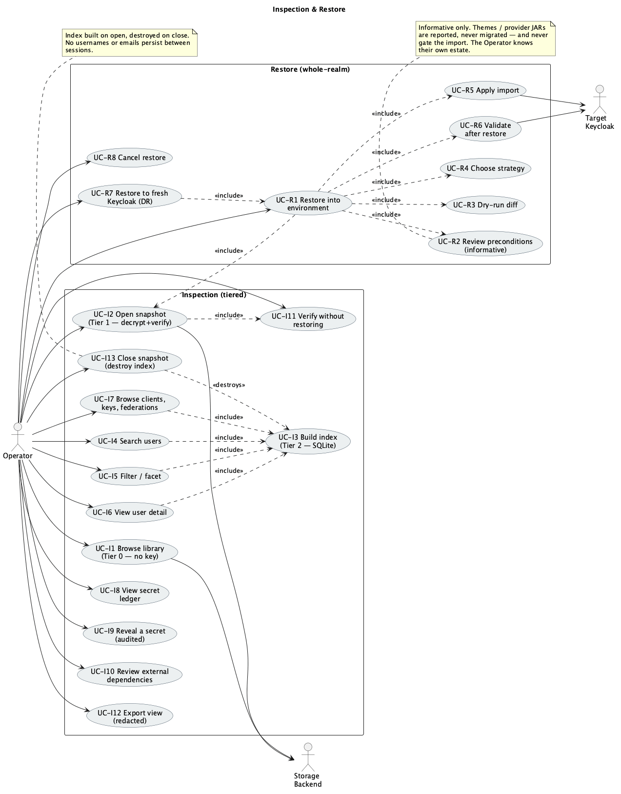

# 05 — Restore

> Restore imports a snapshot into a target **Environment**. It is **whole-realm** — there is no
> cherry-picking (N6) — and it is gated on integrity verification. The **external dependencies**
> the realm needs are shown for information; the Operator is assumed to know their estate.

*Source: [`uc-04-inspection-restore.puml`](./diagrams/uc-04-inspection-restore.puml) · [SVG](./diagrams/svg/uc-04-inspection-restore.svg)*

---

## UC-R1 — Restore a snapshot into an environment

**Goal.** Recreate a realm on a target Keycloak so it behaves as a faithful clone.
**Preconditions.** A snapshot exists; a target environment is defined and tested.

**Main success scenario**
1. Operator selects a snapshot and chooses *Restore*.
2. Operator selects the **target environment**.
3. PortCloak fetches, decrypts and **verifies the integrity tree** (UC-I11).
4. PortCloak shows the **manifest preview** — counts, keys, secret ledger, completeness.
5. PortCloak shows the **preconditions summary** (UC-R2) — informative, not a gate.
6. PortCloak runs a **dry-run diff** against the target realm (UC-R3).
7. Operator chooses a **strategy** — overwrite, skip or merge (UC-R4).
8. Operator confirms; PortCloak applies the import (UC-R5).
9. PortCloak runs **post-restore validation** (UC-R6) and reports drift.
10. PortCloak restates what was **out of scope**: sessions were not carried, so users will
    re-authenticate — while token continuity holds if the signing key travelled.

**Alternate flows**
- **A1 — Restore into the environment it came from** (rollback). Allowed; the diff makes the
  change explicit.
- **A2 — Restore into a different Keycloak version.** Permitted with a compatibility warning;
  cross-version transformation is a non-goal (N2).

**Exceptions**
- **E1 — Integrity verification fails.** **Restore is blocked outright.** A snapshot that cannot
  be proven intact is never written to a target.
- **E2 — Decryption fails.** Non-retryable; restore does not start.
- **E3 — Target unreachable.** Reported; nothing was written.
- **E4 — Import fails midway.** The import log is preserved, the failure point named, and the
  target is left in whatever state Keycloak reached — PortCloak reports this honestly rather
  than claiming success or implying a rollback it cannot perform.

**Postconditions.** Target realm imported, or unchanged with a clear reason.
**Covers.** FR-R1, FR-R4, N6.

---

## UC-R2 — Review restore preconditions

**Goal.** Make the Operator aware of what this realm expects to find on the destination.

**Main success scenario**
1. PortCloak lists the snapshot's **external dependencies** — themes, provider JARs, keystores —
   each with its type, name and the path it was detected at.
2. It states the consequence plainly: a realm referencing a missing theme or authenticator SPI
   **imports cleanly and then fails at login**.
3. It shows the integrity and decryption results alongside as already-passed items.
4. The step is **informative only**. Nothing is checked off and nothing is blocked — the Operator
   manages these environments and is assumed to know what is deployed where. *Next* stays enabled.

**Alternate flows**
- **A1 — No dependencies detected.** The step says so and moves on.
- **A2 — Detection was skipped at capture.** Shown as *not checked*, so absence of data is never
  presented as absence of dependencies.

**Postconditions.** The dependency list has been surfaced before import and recorded with the
restore in the audit log. No gate was imposed.
**Covers.** FR-D2, FR-R2.

---

## UC-R3 — Preview changes with a dry run

**Goal.** See what the import would do before it does it.

**Main success scenario**
1. PortCloak reads the target realm (if it exists) via the Admin API.
2. It diffs the snapshot's manifest and projections against the target realm.
3. It reports **added / removed / changed** per category, with counts and notable items.
4. Secret values are excluded; only "secret changes: yes/no" is reported.

**Alternate flows**
- **A1 — Realm does not exist on the target.** Presented as a pure create, with totals.
- **A2 — Target unreadable.** The dry run is marked unavailable and the Operator is told the
  import will proceed without a preview — it is not silently skipped.

**Postconditions.** Read-only on the target.
**Covers.** FR-R2.

---

## UC-R4 — Choose an import strategy

**Goal.** Decide what happens to resources that already exist.

**Main success scenario**
1. Operator picks one of:
   - **Overwrite** — replace the existing realm entirely.
   - **Skip** — create only what is missing, leave existing resources untouched.
   - **Merge** — apply the snapshot over the existing realm (`partialImport` on a running server).
2. The dry-run summary updates to reflect the chosen strategy.
3. PortCloak restates that restore is **whole-realm**: the strategy governs conflict handling, not
   which resources are selected.

**Alternate flows**
- **A1 — Overwrite on a non-empty realm.** Requires typing the realm name to confirm, because it
  is destructive and irreversible.

**Postconditions.** Strategy recorded and applied at import.
**Covers.** FR-R3, N6.

---

## UC-R5 — Apply the import

**Goal.** Write the realm to the target.

**Main success scenario**
1. PortCloak pushes the realm representation to the target environment.
2. It imports via **offline `kc.sh import`** where the server can be stopped, or the **Admin API**
   (`partialImport` for merge) against a running server.
3. The import log is streamed live.
4. On success, the outcome is recorded in the audit log.

**Alternate flows**
- **A1 — Ephemeral clone for import.** On Docker/Kubernetes, the same clone mechanism used for
  capture (UC-C3/UC-C4) runs the offline import without disturbing the serving instance.
- **A2 — Large realm.** Users are imported from the per-file artifacts with progress reported.

**Exceptions**
- **E1 — Connection drops.** Import is **not** blindly retried — a partially applied import is
  reported with its log so the Operator decides, since replaying an import is not always safe.
- **E2 — Keycloak rejects the representation.** The error is surfaced verbatim with the offending
  resource.

**Postconditions.** Realm imported; log retained.
**Covers.** FR-R1, FR-R3.

---

## UC-R6 — Validate after restore

**Goal.** Confirm the target matches what the snapshot promised.

**Main success scenario**
1. PortCloak re-reads the target realm via the Admin API.
2. It compares counts (users, clients, roles, groups) and **key KIDs** against the manifest.
3. It reports drift explicitly, and confirms whether the **active signing key** is present —
   the token-continuity check.
4. It restates the out-of-scope items: sessions were not carried; themes and provider JARs were
   the Operator's responsibility.

**Alternate flows**
- **A1 — Admin API unreachable.** Validation is reported as **not performed** rather than passed.

**Exceptions**
- **E1 — Drift found.** Listed per category with expected vs actual. The restore is not retried
  automatically.

**Postconditions.** A validation report exists alongside the restore in the audit log.
**Covers.** FR-R1, FR-M2.

---

## UC-R7 — Restore into a freshly provisioned Keycloak

**Goal.** Stand up a new environment from a snapshot — the disaster-recovery path.

**Preconditions.** A new Keycloak exists with an empty database and is registered as an
environment. Any themes and provider JARs the realm expects should already be deployed — UC-R2
lists them, but does not enforce it.

**Main success scenario**
1. As UC-R1, with the dry run presented as a pure create.
2. Offline `kc.sh import` is preferred, since the server can be stopped freely.
3. Post-restore validation confirms counts and key KIDs.

**Alternate flows**
- **A1 — Several realms.** Restored one snapshot at a time; each is independent (FR-S6).

**Exceptions**
- **E1 — Version mismatch with the source.** Warned before import (UC-R1 A2).

**Postconditions.** New instance carrying the realm, with existing passwords, OTP and passkeys
working, client secrets unchanged and prior tokens still verifiable.
**Covers.** FR-R1, G1.

---

## UC-R8 — Cancel a restore

**Goal.** Stop before or during an import.

**Main success scenario**
1. Operator cancels.
2. If the import has **not started**, nothing was written; the job ends cleanly.
3. If an ephemeral clone was created for the import, **teardown runs** (UC-C11).

**Alternate flows**
- **A1 — Cancel during import.** PortCloak stops issuing work but states plainly that **already
  applied changes remain** — it does not claim a rollback it cannot deliver.

**Postconditions.** No clone left behind; target state described accurately.
**Covers.** FR-C11, NFR-5.
