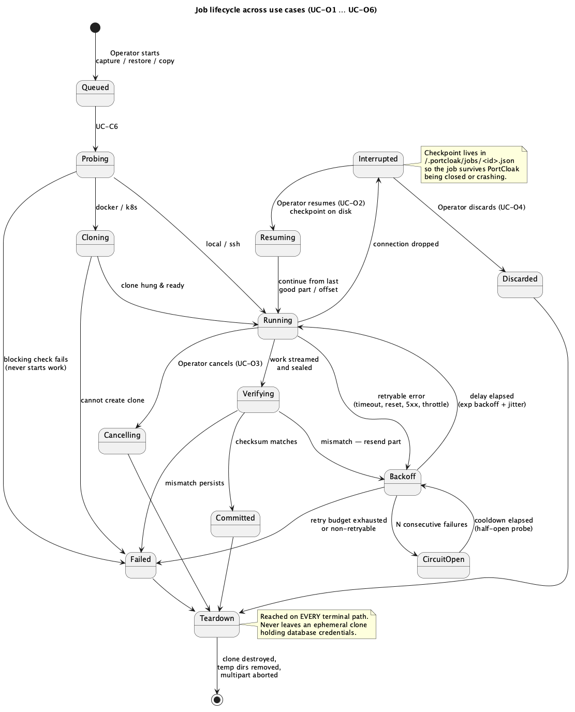

<!--
  Copyright 2026 Muhammad Salah
  SPDX-License-Identifier: Apache-2.0
-->

# 06 — Operations

> Jobs, resilience, configuration and audit — the cross-cutting behaviour that makes the other
> packages survivable on bad connections and inspectable afterwards.

*Source: [`uc-05-job-lifecycle.puml`](./diagrams/uc-05-job-lifecycle.puml) · [SVG](./diagrams/svg/uc-05-job-lifecycle.svg)*

---

## UC-O1 — Monitor running work

**Goal.** See what PortCloak is doing right now.

**Main success scenario**
1. Operator opens *Activity*.
2. Each job shows kind (capture/restore/index/copy), realm, environment, storage, elapsed time and
   a **phase pipeline**: Probe → Clone → Export → Fetch → Verify → Teardown → Package → Upload.
3. The live phase is highlighted; completed phases are ticked.
4. On Docker/Kubernetes captures, the **ephemeral clone's lifecycle is shown explicitly** — created,
   running, destroyed — so its existence is never invisible.
5. Streamed `kc.sh` output is shown, redacted.

**Postconditions.** Read-only.
**Covers.** NFR-5.

---

## UC-O2 — Resume an interrupted job

**Goal.** Continue after a dropped connection instead of starting over.

**Preconditions.** A job reached *Interrupted* with a checkpoint written to
`~/.portcloak/jobs/<job-id>.json`.

**Main success scenario**
1. The job appears as **Interrupted — Resume**, with what failed, how far it got and why.
2. Operator chooses *Resume*.
3. PortCloak reloads the checkpoint and continues from the last good position:
   - **S3** — re-lists uploaded parts and continues the multipart upload.
   - **Azure** — re-stages only missing block IDs and commits.
   - **SSH/SFTP** — re-opens the remote file at the saved byte offset.
   - **Target fetch** — re-fetches from the last fully-received artifact.
4. The rolling checksum continues rather than re-reading everything.
5. On completion the checkpoint is removed.

**Alternate flows**
- **A1 — Resume after restarting PortCloak.** The primary case: checkpoints are on disk precisely
  so a job survives the app being closed, or crashing.
- **A2 — Resume after the source changed.** For captures already sealed, resume only affects the
  upload, so the source is irrelevant.

**Exceptions**
- **E1 — Checkpoint stale or invalid.** PortCloak refuses to resume and offers to restart the job,
  rather than resuming into a corrupt object.
- **E2 — Multipart upload expired server-side.** Reported; the upload restarts and the orphaned
  parts are aborted so no cost accrues.
- **E3 — Retry budget exhausted.** The job moves to *Failed* with the full attempt history.

**Postconditions.** Job completes, or fails with an honest account. **No partial object is ever
presented as complete.**
**Covers.** NFR-1, NFR-8, FR-C11.

---

## UC-O3 — Cancel a job

**Goal.** Stop work deliberately.

**Main success scenario**
1. Operator cancels.
2. The cancellation propagates through the whole stack via context cancellation.
3. **Teardown runs**: ephemeral clones destroyed, remote temp directories removed, multipart
   uploads aborted, partial local files removed.
4. The job ends as *Cancelled* with what had completed.

**Exceptions**
- **E1 — Teardown fails.** Raised prominently with the resource identifier, and retried on next
  launch (UC-C12).

**Postconditions.** No orphaned clones, no orphaned upload parts.
**Covers.** FR-C11, NFR-1.

---

## UC-O4 — Discard an interrupted job

**Goal.** Abandon a job that will not be resumed.

**Main success scenario**
1. Operator chooses *Discard* and confirms.
2. PortCloak aborts any server-side multipart/block state, deletes the local checkpoint and any
   partial bundle, and records the discard.

**Postconditions.** No residue locally or remotely.
**Covers.** NFR-1.

---

## UC-O5 — Understand a failure

**Goal.** Turn "it failed" into something actionable.

**Main success scenario**
1. Operator opens a failed or interrupted job.
2. The **partial-failure ledger** shows, per item: phase, item, attempts, last error, outcome.
3. Retryable and non-retryable failures are distinguished — an auth rejection is never retried and
   is labelled as such.
4. Where a circuit breaker opened, that is shown along with the cooldown, rather than appearing
   as a hang.

**Postconditions.** Read-only.
**Covers.** NFR-5, NFR-1.

---

## UC-O6 — Survive a flaky connection

**Goal.** Complete work over a link that keeps dropping. *(System-driven; no Operator action.)*

**Main success scenario**
1. A transient failure occurs — timeout, reset, 5xx, throttling.
2. PortCloak classifies it **retryable** and retries with exponential backoff plus jitter, within
   a bounded budget.
3. On repeated failures against one endpoint, the **circuit breaker opens**, pausing work instead
   of hammering a dead endpoint; a half-open probe decides when to resume.
4. If the transfer drops entirely, the job becomes *Interrupted* with a checkpoint (UC-O2).

**Alternate flows**
- **A1 — Non-retryable failure** (auth, 404, bad request): fails fast, no retry.
- **A2 — Checksum mismatch on a part:** only that part is re-sent; persistent mismatch fails the
  job rather than committing bad data.

**Postconditions.** Either the work completes, or it stops in a resumable, honestly-labelled state.
**Covers.** NFR-1, NFR-2.

---

## UC-O7 — Edit configuration outside the app

**Goal.** Change configuration with ordinary tools.

**Main success scenario**
1. Operator edits `~/.portcloak/config.yaml` in a text editor, or copies it to another machine.
2. PortCloak reloads it (on next launch or on demand) and validates it.
3. Entries whose **keychain secret is missing on this machine** are shown as *credential missing*
   and prompt for re-entry — the config is portable, the secrets deliberately are not.

**Alternate flows**
- **A1 — Version control.** Because the file holds no secrets, it can be committed safely.
- **A2 — Move the folder.** Settings relocates the whole `~/.portcloak/` tree — config, audit
  log, job checkpoints, logs, working files — onto an encrypted volume, off a synced home
  directory, or anywhere else. The keychain and every stored snapshot stay where they are. The
  running application follows the folder; it does not ask to be restarted
  ([09 §9.1c](../09-workflows-and-ui.md)).

**Exceptions**
- **E1 — Malformed YAML.** PortCloak reports the line and refuses to start with a half-parsed
  config, rather than silently dropping entries.
- **E2 — Unknown fields.** Preserved and reported, so a file written by a newer version is not
  destroyed by an older one.
- **E3 — The folder cannot be moved there.** A destination that is relative, is the current
  folder, sits inside it, contains it, is a file, is not empty, or has no parent to be created in
  is refused *before anything moves* — a half-completed move splits the operator's environments,
  keys and checkpoints across two folders with the app bound to neither.
- **E4 — Something is holding the folder.** An open snapshot or a job in flight refuses the move
  and names the screen to go to. Both hold paths under the old root for their whole lives.
- **E5 — `PORTCLOAK_HOME` is set.** It is set outside the application and wins. The screen reports
  the folder as pinned and disables the move rather than offering something it cannot deliver.

**Postconditions.** Configuration is transparent, portable and hand-editable (NFR-11).
**Covers.** FR-N6, NFR-11.

---

## UC-O8 — Review the audit log

**Goal.** See what the tool has done.

**Main success scenario**
1. Operator opens *Audit log*.
2. Entries show action, time, environment/storage involved, and outcome — captures, restores,
   secret reveals, exports, deletions, encryption opt-outs, precondition overrides.
3. **No values are recorded**, and **no user identity is recorded** — PortCloak is a single-user
   local tool with no accounts (N8).

**Alternate flows**
- **A1 — Filter** by action type or date range.
- **A2 — Export** the log for a ticket.

**Postconditions.** Read-only.
**Covers.** NFR-5, N8.

---

## UC-O9 — Start the application

**Goal.** Get to a usable state with no ceremony.

**Main success scenario**
1. Operator launches PortCloak. **There is no sign-in** (N8) — it opens directly on the workspace.
2. PortCloak loads `~/.portcloak/config.yaml`, restores the job list, and sweeps for
   **orphaned ephemeral clones** (UC-C12) and **stale index files** (UC-I13 A2).
3. The library is shown at Tier 0, requiring no decryption key.

**Alternate flows**
- **A1 — First run.** No config exists; PortCloak creates `~/.portcloak/` and guides the Operator
  to define an environment and a storage.
- **A2 — Interrupted jobs present.** Surfaced immediately as resumable.

**Exceptions**
- **E1 — Home folder not writable.** Reported with the path; PortCloak runs read-only rather than
  silently losing configuration.

**Postconditions.** Ready to work; residue from a previous crash cleaned up.
**Covers.** N8, NFR-11, FR-C11.

---

## UC-O10 — Purge local working data

**Goal.** Leave the workstation clean.

**Main success scenario**
1. Operator chooses *Purge local data*.
2. PortCloak lists exactly what it will remove: index files, decrypted working files, completed
   job checkpoints, and cached bundles — with sizes.
3. It states clearly what it will **not** touch: `config.yaml`, keychain secrets, and snapshots in
   storage.
4. Operator confirms; PortCloak deletes and reports.

**Alternate flows**
- **A1 — Active jobs.** Their checkpoints are excluded and the reason is shown.

**Postconditions.** No decrypted realm data or PII remains locally; configuration and stored
snapshots intact.
**Covers.** NFR-10, NFR-3.
